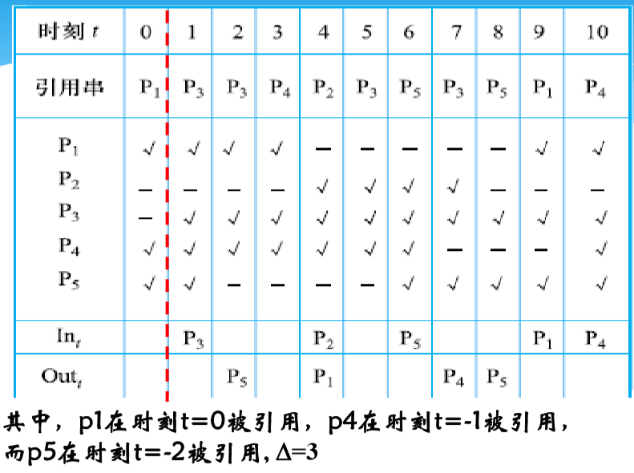
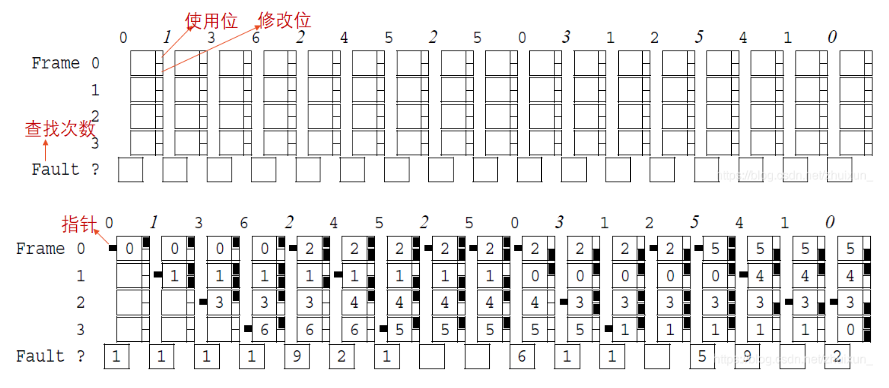
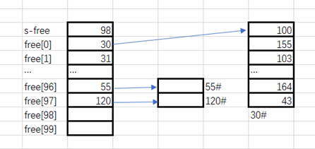

 

## 一、操作系统基础

### 1、操作系统概观

#### （1）计算机系统的组成及其层次结构

答：组成分硬件和软件：层次结构 应用程序-〉系统程序-〉操作系统-〉硬件。

#### （2）操作系统的定义和目标

操作系统是计算机系统最基本的系统软件，它管理软硬件资源、控制程序执行，改善人机界面，合理组织计算机工作流程，为用户使用计算机提供良好运行环境。
目标：方便用户使用、扩充机器功能、管理各类资源、提供系统效率、构筑开放环境。

#### （3）操作系统与支撑软件及应用软件的主要区别

虽然它们都是软件，但操作系统有权分配资源，而支撑软件及应用软件只能通过操作系统使用资源，两者是控制与被控制的关系；操作系统直接作用于硬件之上，隔离其他上层软件，并为其提供接口与服务。因此操作系统是软件系统的核心，是各种软件的基础运行平台。

#### （4）操作系统的资源管理技术

**①操作系统的资源管理技术（资源复用、资源虚化、资源抽象）**

- 资源复用有两种基本方法：空分复用共享和时分复用共享。 

- 空分复用共享：资源可以进一步分割成更多和更小的单位供进程使用。举例：主存和辅助存储器（磁盘）资源。

- 时分复用资源：进程占用该类资源使用后，很可能随时被剥夺，被另一个进程抢占使用。举例：处理器资源和磁盘机。根据资源物理特性的差别，可进一步把时分复用划分成时分独占式和时分共享式。进程获得时分独占式资源后对资源执行多个操作，通常使用一个完整周期后才会释放，比如磁带机。时分复用共享式资源是指进程占用该资源后很可能随后被剥夺，被另一个进程抢占使用，如处理器。

- 资源虚拟：对资源进行转化、模拟或整合，把一个物理资源转变为逻辑上的多个对应物，创建无需共享的多个独占资源的假象，以达到多用户共享一套计算机物理资源的目的。操作系统虚拟性的意义：屏蔽、隔离具体环境，提高使用接口友好，以便以抽象统一方式使用资源。虚拟的具体应用：虚拟技术用于外部设备，实现虚拟设备如虚拟网卡、虚拟光驱。虚拟技术用于存储资源，实现虚拟内存，虚拟技术用于文件系统，实现虚拟文件系统（VFS）

- 资源抽象：通过创建软件来屏蔽硬件资源的物理特性和接口细节，简化对硬件资源的操作、控制和使用，即不考虑物理细节而对资源执行操作。
  资源复用和资源虚化的主要目的是解决物理资源数量不足的问题，资源抽象则用于处理系统的复杂性，重点解决资源的易用性。

**② 操作系统的基本抽象（进程抽象、虚存抽象和文件抽象）**

进程是处理器的一种抽象、虚存是内存的一种抽象、文件时设备的一种抽象，于是可面向进程而不是处理器，面向虚存而不是内存，面向文件而不是设备，方便系统对资源的管理、控制和调度。

**③ 操作系统虚拟机**
操作系统虚拟机是在裸机上配置操作系统，由操作系统对物理计算机实施仿真而获得的，为用户提供了一种简单、清晰、易用、高效的计算机模型。虚拟机的每种虚拟资源都是物理资源通过复用、虚拟或抽象得到的产物。虚拟机提供了进程运行的逻辑计算环境。

#### （5）操作系统的作用与功能

- 主要作用： 

- 服务用户—操作系统作为用户接口和公共服务程序

- 进程交互—操作系统作为进程执行的控制者和协调者

- 系统实现—操作系统作为扩展机或虚拟机

- 资源管理—操作系统作为资源的管理者和控制者

- 功能：处理器管理，存储管理，设备管理，文件管理，网络与通信管理。

#### （6）操作系统的主要特性（并发性、共享性、异步性）

- 并发性：指两个或两个以上的活动或事件在同一个时间间隔内发生。
  补充：并行性是指两个或两个以上的活动或时间在同一时刻发生。关系：并行是并发的特例，并发是并行的拓展。

- 共享性：指计算机系统的资源可以被多个并发执行的程序共同使用，而不是被某个程序独占。

- 异步性：在多道程序环境中，允许多个程序并发执行，并发活动会导致随机事件的发生，由于资源有限而程序众多，每个程序并非连贯的，而是走走停停。

### 2、操作系统的发展与分类

#### （1）操作系统的分类

- 批处理操作系统：根据预先设定的调度策略选择若干作业并发地执行，系统的资源利用率高，作业吞吐量大。
  补充：作业是把程序、数据连同作业说明书组织起来的任务单位。

- 分时操作系统：允许多个联机用户同时使用一个计算机系统进行交互式计算的操作系统。特点：同时性、独立性、及时性、交互性。

- 实时操作系统：当外部事件或数据产生时，能够对其予以接收并以足够快的速度进行处理，并控制所有实时任务协调运行的操作系统。
  注：如果某个操作系统兼具批处理、分时和实时处理的全部或两种功能、则此操作系统称为通用操作系统。

#### （2）什么是多道程序设计？

答：多道程序设计是允许多个作业(程序)同时进入计算机系统的主存并启动交替计算的方法。

#### （3）操作系统引入多道程序设计的优点

- 一是可以提高CPU、内存和设备的利用率

- 二是可以提高系统的吞吐率，使单位时间内完成的作业数量增加

- 三是可以发挥系统的并行性，使设备与设备之间、CPU与设备之间均可并行工作。

### 3、操作系统基本服务和用户接口

#### （1）什么是系统调用？

程序接口（系统调用）由操作系统实现的完成某种特定功能的过程；它是程序与操作系统的接口。

#### （2）系统调用的执行过程

当CPU执行程序中编写的由访管指令实现的系统调用时会产生异常信号，通过陷阱机制，处理器的状态由用户态转变为内核态，进入操作系统并执行相应的服务例程，以获得操作系统服务，当系统调用执行完毕时，处理器再次切换状态，控制返回至发出系统调用的程序，系统调用是应用程序获得操作系统服务的唯一途径。

### 4、操作系统结构和运行模型

#### （1）什么是操作系统内核

答：内核是一组程序模块，作为可信软件来提供支持进程并发执行的基本功能和基本操作，通常驻留在内核空间，运行于核心态，具有访问硬件设备和所有主存空间的权限，是仅有的能够执行特权指令的程序。

#### （2）操作系统体系结构

操作系统体结构分类有整体式结构、层次性结构、虚拟机结构、客户服务器以及微内核结构等。整体式结构高效但不容易维护，层次性结构便于维护但效率低，虚拟机结构方便资源管理使用，客户服务器及微内核结构便于扩充但通信开销大。

#### （3）机制与策略分离原则的好处

相当于把一个项目分解成稳定和不稳定的两个部分。一旦用户需求发生改变，只需要改变策略即可，机制部分只需少许修改或者完全不需要修改。
总之，机制与策略分离原则可归纳为以下三点：

- 机制由操作系统实现、策略留给用户完成

- 机制放到底层、策略放到高层

- 机制集中在少数模块、策略可分散布在系统多处。

## 二、处理器管理

### 1、相关概念

#### （1）特权指令与非特权指令：

所谓特权指令是指仅供内核程序使用的指令，这些指令涉及改变机器状态、修改寄存器内容、启动设备I/O等敏感性操作。执行这些指令不仅影响程序自身，而且干扰其他程序及操作系统。非特权指令在目态和管态下都能工作，操作系统能够执行全部指令，应用程序只能使用非特权指令。

#### （2）内核态和用户态：

- 内核态（管态）：处理器可以执行全部指令，使用所有资源，并具有改变处理器状态的能力

- 用户态（目态）：处理器只能执行非特权指令。

#### （3）PSW程序状态字的作用和内容

PSW表示不同的处理器工作状态，控制指令执行顺序，保留和指示与程序有关的系统状态，主要作用是实现程序状态的保护和恢复。包括：程序指针、程序状态、中断状态等。

#### （4）中断概念

中断是指在程序执行过程中，遇到急需处理的事件时，暂时中止现行程序在CPU上的运行，转而执行相应的事件处理程序，待处理完成后再返回断点或调度其他程序执行的过程。操作系统是中断驱动的。

#### （5）硬中断和软中断

通过硬件设施来产生中断请求，称作硬中断。利用硬件中断的概念，用软件方式进行模拟，实现宏观上的异步执行效果的中断称作软中断。
关系：两者在中断请求、中断屏蔽、中断触发、中断服务等概念与设施方面十分相似。

#### （6）进程

进程是指可并发执行的程序在某个数据集合上的一次计算活动，也是操作系统进行资源分配和保护的基本单位。

#### （7）线程

是进程中能够并发执行的实体，是进程的组成部分，也是处理器调度和分派的基本单位。
进程与程序：进程是程序关于数据的执行，程序是静态的，进程是动态的。

### （8）原语

​	原语在核心态执行，是完成系统特定功能的不可分割的过程，它具有原子操作，其程序段不允许被中断，或者说原语不能并发执行。

### 2、处理器模式切换的途径

#### （1）用户态到核心态的转换

- 一是程序请求操作系统服务，执行系统调用

- 二是在程序执行时，产生中断事件（如I/O操作完成），运行程序被中断，转向中断处理程序

- 三是在程序运行时产生异常事件(如发生程序性中断、或目态执行特权指令)，运行程序被中断，转向异常处理工作。
  这三种情况都通过中断机制发生，可以说中断与异常是用户态到内核态转换的仅有路径。

#### （2）核心态到用户态的转换

计算机通常提供一条称作加载程序状态字的特权指令，用来实现从系统返回用户态，将控制权转交给应用程序。

#### （3）什么使模式切换，什么是进程切换，以及两者之间的关系？

模式切换时CPU从核心态到用户态，或从用户态到核心态，进程切换是指从一个进程上下文切换到另一个进程上下文，模式切换不一定导致进程切换，进程切换一定导致模式切换。

#### （4）引进进程的原因

- 刻画系统的动态性，发挥系统的并发性，提高资源利用率。

- 它能够解决系统的“共享性”，正确描述程序的执行状态。

#### （5）进程的状态转换模型；

挂起进程的特征:

**三态模型**


 


**五状态模型**


 


**七状态模型**


 


**挂起**：系统资源不能够满足进程运行的要求，就必须挂起某些进程，对换到磁盘镜像区中，释放它占有的某些资源，暂时不参与低级调度，起到平滑系统负荷的目的；也可能系统出现故障。需要暂时挂起一些进程，以便故障消除后再解除挂起并恢复进程运行；用户调试程序过程中，可以请求挂起其进程，以便进行某种检查和修改，总之，引进进程挂起的原因多种多样。

#### （6）进程映像

某时刻进程的内容及其状态集合称为进程映像，包括以下几个要素：进程控制块、进程程序块、进程核心栈、进程数据块。

#### （7）PCB的概念和组成

每个进程有且仅有一个进程控制块（PCB），或称进程描述符，它是进程存在的唯一标识，是操作系统用来记录和刻画进程状态及有关信息的数据结构，是进程动态特征的一种汇集，也是操作系统掌握进程的唯一资料结构和管理进程的主要依据。
包含三类：

- 标识信息：用于唯一的标识一个进程

- 现场信息：现场信息用于保留进程在运行时存放在处理器现场中的各种信息。

- 控制信息：控制信息用于管理和调度进程。

#### （8）引入多线程的目的和优点

进程切换开销大、进程通信代价大、进程间的并发粒度较粗，并发行较高。为此，通过把分配资源与调度执行分离开来，使进程作为资源分配和保护的单位，线程作为系统调度和分派的单位，能被频繁的调度和切换。
引入线程，以减少进程并发执行时所付出的时空开销，使得并发粒度更细、并发行更好。

#### （9）线程的实现

多线程的实现分三类：

- 内核级线程(KLV :Kernel Level Thread)，如Windows、OS/2和March C-Ttread

- 用户级线程(ULV :User Level Thread),如POSIX 1003的Pthread、Java线程库

- 某些系统（如Solaris UI-Thread）提供混合式线程,同时支持ULT和KLT两种线程。

#### （10）处理机调度的层次及调度模型

处理机调度的层次：高级调度，中级调度，低级调度

- 高级调度（作业调度）：从输入系统的一批作业中挑选若干作业进入内存，为其分配资源并创建对应作业的用户进程。

- 中级调度（内存调度）：根据内存资源情况决定内存中所能容纳的进程数目，并完成内存和外存的对换工作。

- 低级调度：决定就绪队列中的哪个进程/线程获得处理器，并将处理器出让给它使用。执行得很频繁。引起低级调度的事件包括： 时钟中断、I/O中断、操作系统调用、信号

#### （11）选择调度算法的周转时间

批处理用户从向系统提交作业开始，到作业完成为止的时间间隔称为作业周转时间。

- 作业i的周转时间T(i)=作业i的完成时间-作业i的提交时间

- 平均周转时间T=（T(1)+T(2)+....+T(n)）/n

- 带权周转时间W(i)=作业i的周转时间/作业i的运行时间

- 平均带权周转时间：类似于平均周转时间。

#### （12）作业和进程的关系

作业是任务实体，进程是完成任务的执行实体；没有作业实体，进程无事可做；没有进程，作业任务无法完成。作业的概念更多的用于批处理操作系统中，而进程则多用于各种多道程序设计系统。

#### （13）低级调度算法

- 先来先服务算法FCFS,First Come First Server(作业调度、进程调度)

- 最短作业优先算法SJF,Shortest Job First(作业调度、进程调度)

- 最短剩余时间优先算法SRTF，Shortest Remaining Time First（进程调度）

- 最高响应比优先算法HRRF，Highest Response Ratio First（作业调度）

- 优先级调度算法（作业调度、进程调度）

- 轮转调度算法RR（时间片调度算法），Round-Robin（进程调度）

- 多级反馈队列调度算法MLFQ，Multi-level Feedback Queue（进程调度）

## 三、同步、通信与死锁

### 1、并发进程

#### （1）并发程序设计

- 并发性：进程的并发性（concurrency）是指一组进程的执行在时间上是重叠的。

- 采用并发程序设计的优点： 

- 若为单处理系统，可以有效地利用资源，让处理器和设备、设备和设备同时工作，充分发挥硬部件的并行工作能力；

- 若为多处理系统，可让进程在不同的处理器上物理地并行工作，加快计算速度；

- 简化程序设计任务，一般来说，编制并发执行的小程序进度快，容易保证正确性。

#### （2）资源竞争的两个控制问题

- 死锁：一组进程因争夺资源陷入永远等待的状态

- 饥饿：一个可运行进程由于其他进程总是优先于它，而被调度程序无限期的拖延而不被执行。关系：死锁进程必然处于饥饿状态，但出于饥饿状态的进程未必陷于死锁。

#### （3）进程互斥：

进程的互斥（mutual exclusion）是解决进程间竞争关系的手段。进程互斥指若干个进程要使用同一共享资源时，任何时刻最多允许一个进程去使用，其他要使用该资源的进程必须等待，直到占有资源的进程释放该资源。

#### （4）进程同步：

进程的同步（Synchronization）是解决进程间协作关系（直接制约关系）的手段。进程同步指两个以上进程基于某个条件来协调它们的活动。一个进程的执行依赖于另一个协作进程的消息或信号，当一个进程没有得到另一个进程的消息或信号时则需等待，直到消息或信号到达才被唤醒。

### 2、临界区管理

#### （1）互斥和临界区

并发进程中与共享变量有关的程序段称为临界区(critical section)。共享变量所代表的资源称为临界资源（critical resource）,即一次仅能供以一个进程使用的资源。

#### （2）临界区调度原则

- 一次至多有一个进程进入临界区内执行

- 如果已有进程在临界区中，试图进入此临界区的其他进程应等待

- 进入临界区内的进程应在有限时间内退出，以便让等待队列中的一个进程进入。
  可把临界区的调度原则总结成三句话：互斥使用，有空让进；忙则要等，有限等待；
  择一而入；算法可行。其中算法可行是指不能因为所选的调度策略造成进程饥饿甚
  至死锁。

#### （3）进程并发中与时间有关的典型错误

永远等待。结果不唯一。解决方法：硬件/软件，临界区管理。

#### （4）实现临界区管理的软件算法

此方法为每个进程设置标志，当标识值为true时表示此进程要求进入临界区，另外，再设置一个指示器turn以指示可以由哪个进程进入临界区，当turn=i时则可由进程pi进入临界区。

```bash
bool inside[2];
inside[0] = false;
inside[1] = false;

enum{0,1} true;

process P0(){
	inside[0] = true;
	true = 1;
	while(inside[1]&&true==1);
  //临界区
	inside[0] = false;
}
process P1(){
	inside[1] = true;
	true = 0;
	while(inside[0]&&true==0);
  //临界区
	inside[1] = false;
}
```

### 3、信号量与PV操作

#### （1）P、V操作原语的定义

- P（s）：将信号量value值减1，若结果小于0，则执行P操作的进程被阻塞，排入与s信号量有关的list所指队列中；若结果大于0，则执行P操作的进程继续执行。

- V（s）：将信号量value值加1，若结果不大于0，则执行V操作的进程从与s信号量有关的list所指队列中释放一个进程，使其转换为就绪态，自己则继续执行；若结果大于0，则执行V操作的进程继续执行。

### 4、管程

把分散在各进程中的临界区集中起来进行管理，并把系统中的共享资源用数据结构抽象地表达出来。管程是一种程序设计语言结构成分，它和信号量具有同等的表达能力。

### 5、进程通信

#### （1）进程间通信的方式

- 信号通信机制

- 管道通信机制

- 消息传递通信机制

- 信号量通信机制

- 共享主存通信机制

#### （2）管道

是连接读写进程的一个特殊文件，允许进程按先进先出方式传送数据,也能使进程同步执行操作。

### 6、死锁

#### （1）死锁定义

如果一个进程集合中的每个进程都在等待只能由此集合中的其他一个进程才能引发的事件，而无限期陷入僵持的局面称为死锁。

#### （2）形成死锁的四个必须条件

- 互斥条件：系统中存在临界资源，进程应互斥地使用这些资源

- 占有和等待条件：进程在请求资源得不到满足而等待时，不释放已占有资源

- 不剥夺条件：已被占用的资源只能由属主释放，不允许被其他进程剥夺

- 循环等待条件：存在循环等待链，其中，每个进程都在链中等待下一个进程所持有的资源，造成这组进程处于永远等待状态。

#### （3）死锁防止

死锁防止策略

- 破坏条件1（互斥条件）：使资源可同时访问而非互斥访问。

- 破坏条件2（占有和等待条件）：静态分配。是指进程必须在执行之前就申请所有的需要的所有资源，且直到所要的资源都满足后才执行。

- 破坏条件3（不剥夺条件）：剥夺能防止死锁，但只适用于内存和处理器资源。

- 破坏条件2&4（循环等待条件）：采用层次分配策略： 

- 资源被分成多个层次

- 当进程得到某一层的一个资源后，它只能再申请较高层次的资源

- 当进程要释放某层的一个资源时，必须先释放占有的较高层次的资源

- 当进程得到某一层的一个资源后，它想申请该层的另一个资源时，必须先释放该层中的已占资源

#### （4）死锁避免：银行家算法。

#### （5）死锁检测和解除

- 死锁检测：资源分配图和死锁定理。

- 死锁恢复：当死锁被检测到后、采用各种方法解除系统死锁以恢复到可运行状态的常用方法有资源剥夺法、进程回退法、进程撤销法、系统重启法。

## 四、存储管理

### 1、地址转换与存储保护

#### （1）编译

源程序经过编译程序（compiler）和汇编程序（assembly）的处理来获得目标代码（也称为目标模块）。

#### （2）链接

链接程序（linker）的作用是根据目标模块之间的调用和依赖关系，将主调模块、被调模块以及所用到的库函数装配和链接成一个完整的可装载执行模块。

- 静态链接：静态链接是指程序装在到内存和运行前，就已将它的所有目标模块及所需要的库函数进行链接和装配成一个完整的可执行程序且此后不再拆分。

- 动态链接：是指在程序装入内存前未事先进行程序各目标模块的链接，而是在程序装载时一边装载一边链接，生成一个可执行程序。

- 运行时链接：运行时链接指将某些目标模块或库函数的链接推迟到执行时才进行。

#### （3）逻辑地址

（由于程序在主存中的位置不可预知）链接时程序地址空间中的地址总是相对某个基准（通常为0）开始编号的顺序地址，称为逻辑地址或相对地址

#### （4）物理地址

物理主存贮器从统一的基地址开始顺序编址的存储单元称为物理地址或绝对地址（物理地址的总体构成物理地址空间）

#### （5）地址转化

逻辑地址转换为物理地址的过程称为重定位、地址映射或地址转换。

### 2、连续存储管理

#### （1）固定分区存储管理

贮存空间被划分程数目固定不变的分区，各分区的大小不等，每个分区只装入一个作业，若多个分区都装有作业，则它们可以并发执行，这是支持多道程序设计的最简单的存储管理技术。

#### （2）可变分区存储管理

又称为动态分区模式，按照作业的大小来划分分区，但划分的时间、大小、位置都是动态的。系统把作业装入主存时，根据其所需要的主存容量查看是否由足够的空间，若有，则按需求分割一个分区分配给此作业；若无，则令此作业等待主存资源。

#### （3）可变分区分配算法：

- 最佳适配：选择与要求的大小最接近的块

- 首次适配：从低地址扫描内存，选择大小足够的第一个可用块

- 临近适配：从上一次放置的位置开始扫描内存，选择下一个大小足够的可用块。

- 最坏适配：扫描整个未分配区表或链表，总是挑选一个最大的空闲区。

#### （4）内存不足的存储管理技术

- 移动技术：当在未分配区表中找不到足够大的空闲区来存放新进程时，可以把已在主存中的进程的分区连接到一起，使分散的空闲区汇集成片，这就是移动技术。

- 对换技术：如果当前一个或多个驻留进程都处于阻塞态，此时选择其中的一个进程，将其暂时移出主存，腾出空间给其它进程使用，同时把磁盘中的某个进程换入主存，让其投入运行，这种互换称为对换。

- 覆盖技术：覆盖是指程序执行过程中程序的不同模块在主存中相互替代，以达到小主存执行大程序的目的（基本的实现技术是：把用户空间分成固定区和一个或多个覆盖区，把控制或不可覆盖的部分放在固定区，其余按调用结构及先后关系分段并放在磁盘上，运行时依次调入覆盖区。
  补充：碎片：根据碎片的出现的情况、可以将碎片分为内部碎片和外部碎片。内部碎片是指已经分配给作业但不能被利用的内存空间，外部碎片是指系统中还没有分配给作业，但由于碎片太小而无法分配给申请内存空间的新进程的存储块。

### 3、分页存储管理

#### （1）分页存储管理基本原理

基本概念：①页面②页框③逻辑地址（页号+页内位移）④内存页框表：表项给出物理块使用情况⑤页表。⑥物理地址=页框号*块长+页内位移。

#### （2）翻译快表

快表中存储进程最近访问的部分页表项，快表项包含页号及对应的页框号，当把页号交给快表后，如果快表中包含此快表项，则立即输出页框号，并形成物理地址；如果找不到，再查主存中的页表以形成地址，同时将页号与页框号登记到快表中。

#### （3）多级页表

采用分页存储管理时页表相当大，则需要占用较大的连续空间存储页表，为此，页表和页面一样也要进行分页，这就形成了多级页表概念。具体做法是：把整个页表分割成许多小页表，每个称为页表页，它的大小与页框长度相同，于是每个页框页含有若干个页表表项。

#### （4）反置页表

反置页表为内存中的物理块建立一个页表并按照块号排序，该表的每个表项包含正在访问该页框的进程标识、页号及特征位，和哈希链指针等，用来完成内存页框到访问进程的页号，即物理地址到逻辑地址的对应转换。

### 4、分段存储管理

#### （1）分段和分页的比较

- 分段是信息的逻辑单位，由源程序的逻辑结构所决定，用户可见

- 段长可根据用户需要来规定，段起始地址可从任何主存地址开始

- 分段方式中，源程序（段号，段内位移）经连结装配后地址仍保持二维结构。

- 分页是信息的物理单位，与源程序的逻辑结构无关，用户不可见

- 页长由系统确定，页面只能以页大小的整倍数地址开始

- 分页方式中，源程序（页号，页内位移）经连结装配后地址变成一维结构

### 5、虚拟存储管理

#### （1）虚拟存储器

在具有层次结构存储器的计算机系统中，采用自动实现部分装入和部分替换功，能从逻辑上为用户提供一个比物理主存容量大的多的，可寻址的“主存储器”。如Windows的虚拟内存和Linux的交换空间。
引入虚拟存储器地好处：①提高内存利用率②为进程提供一致的地址空间，简化了存储器管理③每个进程有独立的地址空间空间，保证了进程间的安全。

#### （2）虚存管理与对换技术

- 虚存管理与对换技术虽说都是在主存和磁盘之间交换信息，但却有很多区别。 

- 对换以进程为单位，当它所需主存大于当前系统拥有量时，无法被对换进主存工作。

- 而虚存管理以页或段为单位，即使进程所需内存大于当前系统拥有的主存总量，仍然能正常运行，因为系统可将进程的一部分页或段换出到磁盘上。

#### （3）局部性原理

大多数程序执行时，在一个较短的时间内仅使用程序代码的一部分，相应的，程序所访问的存储空间也局限于某个区域，这就是程序执行的局部性原理。其表现如下：

- 时间局部性：一条指令的一次执行和下次执行，一个数据的一次访问和下次访问，都集中在一个较短的时期内。

- 空间局部性：当前指令和邻近的几条指令，当前访问的数据和临近的数据，都集中在一个较小的区域内。

#### （4）交换区

在虚存系统中，由于页面替换，操作系统在磁盘上定义一个交换区用来保存临时换出的页面，交换区由磁盘上一个或多个磁盘分区组成，系统在安装配置时就已保留好若干磁盘分区作为交换区。交换区时物理内存的拓展，它和内存一起组成虚拟存储空间。

#### （5）抖动

在进行页面替换时，用来确定被淘汰页的算法称为淘汰算法。如果该算法选择不当，则会出现：整个系统的页面调度非常频繁以至大部分时间都花费在来回调度页面上，而不是执行计算任务，这种现象称为“抖动”。

### 6、全局页面替换策略

- 最佳页面替换算法（OPTimal replacement，OPT）：当要调用一页必须淘汰旧页时，应该淘汰以后不再访问的页，或距现在最续航时间后才访问的页。

- 先进先出页面替换算法（First-In First-Out replacement，FIFO）：总是淘汰在内存中驻留时间最长的页面，认为驻留时间最长的页面，认为驻留时间最长的页不再使用的可能性较大。

- 最近最少使用页面替换算法（Least Recently Used replacement，LRU）：选择最近最长时间没有被使用的页面予以淘汰。

- 第二次机会页面替换算法（Second Chance Replacement，SCR）：首先检查FIFO页面队列中的队首，这是最早进入主存的页面，如果其引用位是0，那么，这个页面最早进入并且最长时间按未被使用，选择此页面淘汰，如果其引用位是1，说明虽然它进入主存的时间较早，但最近仍在使用，于是将其引用位清0，并将这个页面移至队尾，把它看作一个新调入的页，再给一次机会。

- 时钟页面替换算法（Clock policy replacement，Clock）：
  算法实现要点如下： 

- 一个页面首次装入内存时，其引用位置0

- 主存中的任何一个页面被访问时，其引用位置1

- 淘汰页面时，存储管理从指针当前指向的页面开始扫描循环队列，把所遇到的“引用位”是1的页面的引用位置0，并跳过这个页面；把所有遇到的引用位为0的页面淘汰，指针推进一步。

- 扫描循环队列时，如果遇到所有页面的引用位均为1，指针就会环绕整个循环队列一圈，把遇到的所有页面引用位置0，指针听到起始位置，淘汰该页面，并向前推进一步。

- 改进型时钟算法：

淘汰页面时，如果此页面已被修改过，必须将它先重新写回磁盘；但如果所淘汰的是未被修改过的页面，就不需要写磁盘操作，这样看来淘汰修改过的页面比淘汰未被修改过的页面的开销要大。如果把页表项的“引用位”和“修改位”结合起来使用，可以改进Clock算法，页面共组合成4种情况：

1. 最近未被使用，未被修改（r=0,m=0）
2. 最近被引用，未被修改（r=1,m=0）
3. 最近未被引用，但被修改过（r=0,m=1）
4. 最近被引用过，也被修改过（r=1,m=1）

于是改进的Clock页面替换算法可如下执行：

步骤1：选择最佳淘汰页面。从指针当前位置开始扫描循环队列，扫描过程种不改变“引用位”，把遇到的第一个r=0,m=0的页面作为淘汰页。

步骤2：如果步骤1失败，再次从原位置开始，查找r=0,m=1的页面，把遇到的第一个这样的页面作为淘汰页，而在扫描过程中把指针所经过的页面的“引用位”r置为0.

步骤3：如果步骤2失败，指针再次回到起始位置，由于此时所有页面的“引用位”r均为0，再转向步骤1或步骤2操作，这次一定能挑出一个可淘汰的页面。

### 7、局部页面替换算法

1、局部最佳页面替换算法

如果该页面在时间间隔(t,t+d)内未被再次引用，那么就移出；否则，该页被保留在进程驻留集中。例子中d=3

 


2、工作集模型和工作集置换算法：
工作集：指在某一段时间间隔内进程运行所需访问的页面集合，用W(t，Δ)表示在时刻t-Δ到时刻t之间所访问的页面集合，它就是进程在时刻t的工作集 ，变量Δ称为“工作集窗口尺寸 ”。
实现思想：工作集模型用来对局部最佳页面替换算法进行模拟实现，不向前查看页面引用串，而是基于程序局部性原理向后看。



3、缺页频率替换算法
如果本次缺页与前次缺页之间的时间间隔超过临界值T，那么，在这个时间间隔内未被引用的所有页面都将被移出工作集。

### 8、请求段页式虚拟存储管理

因为段式存储容易产生段之间的碎片，故和页式结合，形成段页式虚存管理。

#### （1）请求段页式虚拟存储基本原理

- 虚地址以程序的逻辑结构划分成段。

- 实地址划分成位置固定、大小相等的页框。

- 将每一段的线性地址空间划分成页框大小相仿的页面。

- 逻辑地址分为3个部分：段号s、段内页号p、页内位移d。

#### （2）动态地址转换过程

 

## 五、设备管理

### 1、I/O硬件原理

#### （1） I/O系统

通常把I/O设备及其接口线路、控制部件、通道和管理软件称为I/O系统，把计算机的主存储器和设备介质之间的信息传送操作称为I/O操作。

#### （2）I/O控制方式的分类

- 轮询方式：CPU必须不停地循环测试I/O设备的状态端口，当发现设备处于准备好(Ready)状态时，CPU就可以与I/O设备进行数据存取。操作耗费大量的CPU时间、无法检测设备错误、只能串行工作。

- 中断方式：当I/O结束时，会向CPU发出中断请求信号，CPU收到信号就可以采取相应措施。CPU与I/O设备可以并行工作，与程序查询方式相比，大大提高了CPU的利用率。CPU仍需要花费较多的时间处理中断。中断次数增多时易导致数据丢失。

- DMA方式：允许主存储器和I/O设备之间通过“DMA控制器(DMAC)”直接进行批量数据交换，除了在数据传输开始和结束时，整个过程无须CPU的干预。

- 通道方式：给CPU发出I/O启动命令后，由通道指令完成启动设备等工作。与DMA控制方式相比，通道所需要的CPU控制更少。

#### （3）通道

是一种专用处理器，具有自己的指令系统，它的指令常称通道命令。
通道方式I/O过程的三个阶段：I/O启动阶段 I/O操作阶段 I/O结束阶段

### 2、I/O软件原理

#### （1）I/O软件设计目标和原则

I/O软件的总体设计目标是高效率和通用性。为了实现这些目标，把软件组织成层次结构，低级软件用来屏蔽硬件细节，高级软件向用户提供简洁、友善的界面。操作系统把I/O软件组织成4个层次：I/O中断处理程序；I/O设备驱动程序；独立于设备的I/O软件和用户空间的I/O软件。

#### （2）设备驱动程序

包括与设备密切相关的所有代码，其工作是：把用户提交的逻辑I/O请求转化为物理I/O操作的启动和执行。

### 3、I/O缓冲

#### （1）引入缓入技术的目的

为了改善中央处理器与外围设备之间速度不匹配的矛盾，以及协调逻辑记录大小与物理记录大小不一致的问题，提高CPU和I/O设备的并行性，减少I/O对CPU的中断次数和放宽对CPU中断响应时间的要求。
缓冲区按用途可分为：输入缓冲区，处理缓冲区和输出缓冲区。

#### （2）缓冲区高速缓存

为了减少访问磁盘的次数，避免数据项的重复产生，内核建立一个数据缓冲区高速缓存，专门用于保存最近使用过的磁盘数据块。

### 4、驱动调度程序

#### （1）存储设备的物理结构

为了访问磁盘上的一条物理记录，必须给出三个参数：柱面号、磁头号、扇区号。

#### （2）驱动调度

在多个输入输出请求过程中，系统采用某种调度策略，使能按最佳次序执行要求的诸请求。所使用的算法叫做驱动调度算法。

- 先来先服务算法（First Come First Server algorithm，FCFS）：按顺序处理请求，对于所有进程是公平的。

- 最短查找时间算法（Shortest seek time first algorithm，SSTF）：总是先执行查找时间最短的请求。

- 扫描算法（scan algorithm）：移动臂每次沿一个方向移动，扫过所有柱面，遇到最近的I/O请求便进行处理，直至到达最后一个柱面后，再向相反的方向移动过来。

- 分步扫描算法：将I/O请求分成长度位N的子队列，按FIFO算法依次处理每个子队列，而每个子队列采用扫描算法，处理完一个后再服务下一个子队列。扫描期间新到达的I/O请求可被放入等待队列中，以避免出现磁臂粘住现象。

- 电梯调度算法：和扫描算法很像，不同的是，如果当前移动方向上没有但相反方向有访问请求时，就改变移动臂的移动方向，然后处理所遇到的最近的I/O请求。

- 循环扫描算法：移动臂总是从0号柱面至最大号柱面顺序扫描，然后直接返回0号柱面重复进行，归途中不再提供服务，构成一个循环，缩短处理新来请求的最大延迟。

### 5、设备分配

#### （1）设备独立性

用户通常不指定物理设备，而是制定逻辑设备，使得用户作业和物理设备分离开来，再通过其他途径建立逻辑设备和物理设备之间的映射，设备的这种特性称为设备独立性。
好处：用户与物理的外围设备无关，系统增减或变更外围设备时程序不必修改；易于对付I/O设备的故障

#### （2）设备分配方式

从设备的物理特性来看，可分为独占型设备、共享设备和虚拟设备三类，相应管理和分配设备的技术就分为静态分配、动态分配和虚拟分配。

### 6、虚拟设备

#### （1）SPOOLING系统

Spooling系统是能把一个物理设备虚拟化成多个虚拟（逻辑）设备的技术，在中断和通道硬件的支撑下，操作系统采用多道程序设计技术、合理分配和调度各种资源，实现联机的外围设备同时操作。Sppoling具有能将输入设备输入至磁盘输入缓冲区的“预输入程序”，能将信息从磁盘输出缓冲区输出至输出设备的“缓输出程序”，及控制作业和磁盘缓冲区之间交换信息的“井管理程序”。

## 六、文件管理

### 1、文件与文件系统

#### （1）文件系统

​	文件系统是操作系统中负责存取和管理信息的模块，它用 统一的方式管理用户和系统信息的存储、检索、更新、共享和保护，并为用户提供一整套方便有效的文件使用和操 作方法。

#### （2）文件及文件名

- 文件：是由信息按照一定结构方式组成，可持久性保存的抽象机制，由于它必定存储在某种设备上，故也可认为文件是设备的一种抽象。

- 文件名：文件名是字母或数字组成的字母数字串，它的格式和长度因系统而异。

### 2、文件存取方法

- 顺序存取：无论是无结构字节流文件，还是有结构记录式文件，存取操 作都在上次的基础上进行，

- 直接存取：又称随机存取，可以非顺序地从文件中的任何位置存取文件内容。

- 索引存取：基于索引文件的索引存取方法，由于文件中的记录不按它的位置， 而按它的记录名或记录键来编址，所以，用户提供记录名或记录 键后，先按名搜索，再查找到所需记录。

### 3、文件目录

#### （1）文件系统的分层结构

- 文件管理--实现文件的逻辑结构，为用户提供各种文件系统调用，及文件访问权限的设置等工作；

- 目录管理--负责查找文件描述符，进而找到需要访问的文件，及进行访问权限检查等工作；

- 磁盘主存映射管理--将文件的逻辑地址转换成磁盘的物理地址，即由逻辑块号找到柱面号、磁头号和扇区号， 具体的数据传输操作由设备管理实现。

#### （2）文件控制块、文件目录与目录文件

- 文件控制块（FCB）：是操作系统为每个文件建立的唯一数据结构，其中包含了全部文件属性，其目的是为方便操作系统对文件的管理、控制与存取。于是，一个文件由两部分组成：FCB和文件体（文件信息）。

- 文件目录：为了加快文件的查找，通常把FCB集中起来进行管理，组成文件目录。 文件目录包含许多目录项，目录项有两种，用于描述子目录和文件FCB。文件目录的作用：主要作用是将文件名转换为文件在外存的物理位置，实现按名存取的功能。使操作系统能有效地对文件实施统一管理。此外还有提高目录检索速度，文件共享等功能。

- 目录文件： 全部由目录项构成的文件称为目录文件，与普通文件不同的是，目录文件永远不会空，它至少包含两个目录项：当前目录项“.”和父目录项“..”。

#### （3）索引节点与基本目录项

Linux系统的FCB 中的文件名和其他管理信息分开，其他信息单独组成一个数据结构，称为索引节点inode，此索引节点在磁盘上的位置由inode 号标识。于是目录项中仅剩下文件名和inode号，称为基本目录项。文件系统中的每个文件都有一个磁盘 inode 与之对应，这些 inode 被集 中存放于磁盘上的 inode 区。

### 4、文件组织与数据存储

#### （1）文件的逻辑结构分两种形式：流式文件，记录式文件。

逻辑结构：文件逻辑结构是从用户观点出发，研究用户概念中的信息组成方式。

- 流式文件：这是一种无结构的文件，文件内的数据不再组成记录，指示一串顺序的信息集合，称为字节流文件。

- 记录式文件：这是一种有结构的文件，它包含若干逻辑记录，逻辑记录是文件中按信息在逻辑上的独立含义所划分的信息单位。

#### （2）记录的成组与分解

​	若干逻辑记录合并成一组，写入一块叫做记录成组，这时每块中的逻辑记录的个数称为块因子。成组操作先在系统输出缓冲区内进行，凑满一块后才将缓冲区内的信息写到存储介质上，反之，当存储介质上的一个物理块读进系统缓冲区后，把逻辑记录从块中分离出来的操作叫做记录的分解。

#### （3）记录键

​	为了方便记录式文件的组织和管理，提高文件记录的查找效率，通常，对逻辑文件的每个逻辑记录至少指定一个与 之对应的基本数据项，利用它可与同一文件中的其他逻辑 记录区别开来，这个用于标识某个逻辑记录的数据项，称为记录键，也叫关键字，简称键。在同一个文件中，能唯一地标识某个逻辑记录的记录键，称为主键。

### 5、文件物理结构

物理文件是从系统观点出发，考虑文件在物理介质上的组织和存放方式。

- 构造文件物理结构的方法：计算法、指针法。

- 顺序文件、链接文件、索引文件、直接文件。

### 6、文件类系统调用

#### （1）文件系统磁盘结构

- 超级块：占用1#号块，存放文件系统结构和管理信息

- 索引节点区：2#～k+1#块 存放inode表，每个文件都有各种属性，它们被记录在称为索引节点 inode的结构中；inode表是inode结构的列表，文件系统中的每个文件在该表中都有一个inode。

- 数据区：k+2#～n#为数据块 文件的内容保存在这个区域，磁盘上所有物理块的大小是一样的，如果文件包 含超过一块的数据，则文件内容会存放在多个盘块中。

#### （2）内存映射文件的基本原理和优点

​	内存映射文件技术把进程的虚地址空间与某一个盘文件关联起来，使得进程对文件的存取转换位对关联存储区域的访问，通过文件系统与存储管理相结合来实现。具有：方便易用、节省空间、便于共享、灵活高效等优点。

#### （3） 文件共享

​	文件静态（链接）共享、文件动态共享、文件符号链接共享。

### 7、文件空间管理

- 位示图：硬盘空间通常使用固定大小的块，可方便地用位示图管理，用若干字节构成一张位示图，其中每一字位对应一个物理块，字位地次序与块地相对次序一致，字位为1表示相应块已被占用，字位0表示该块空闲。
  空闲区表：该方法常用于连续文件，将空闲存储块地位置以及连续空间的块数构成一张表。

- 空闲块链：把所有空闲块连接在一起，系统保持指针指向第一个空闲块，每一空闲块中包含指向下一空闲块的指针。

### 8、虚拟文件系统

​	虚拟文件系统也称虚拟文件系统开关VFS（Virtual Filesystem Switch），它是内核的一个子系统，提供一个通用文件系统模型，该模型概括所能见到的文件系统常用功能和行为，处理一切和底层设备驱动相关的细节，为应用程序提供标准的接口（文件系统API）。

## 七、安全机制

### 1、文件保护的基本方法

文件保护通过口令保护、加密保护和访问控制等方式实现，其中，口令保护和加密保护是为了防止用户文件被他人存取，而访问控制则用于控制用户对文件的访问方式。

### 2、强制访问控制

安全系统通过比较主、客体的相应标记来决定是否授予一个主体对客体的访问权限。自主访问控制：资源属主按照自己的意愿指定系统中的其他用户对其资源的访问权限的访问控制机制。

### 3、列出操作系统中常用的安全机制(中文及其英文名)

- 认证机制(authentication)

- 授权机制(authorization)

- 加密机制(encryption)

- 审计机制(audit 或 auditing) 。

## 八、存储相关

### 1、页面置换算法

#### （1）最佳置换算法

***其选择的被淘汰的页面将是以后永不使用的，或许是最长（未来）时间内不再被访问的页面。***


#### （2）先进先出（FIFO）页面置换

**该算法总是淘汰最先进入内存的页面，即选择在内存中驻留时间最久的页面予以淘汰。**


#### （3）最近最久未使用（LRU）置换算法


#### （4）最少使用（LFU）置换算法

#### （5）Clock算法

- **简单的Clock算法**

**当利用简单Clock算法时，只需为每页设置一位访问位，再将内存中的所有页面都通过链接指针链接成一个循环队列。当某页被访问时，其访问位被置为1.置换算法在选择一页淘汰时，只需检查页的访问位。如果是0，就选择该页换出；若为1，则重新将其置为0，暂不换出，给予该页第二次驻留内存的机会，再按照FIFO算法检查下一个页面。当检查到队列中最后一个页面时若其访问位仍为1，则再返回到队首去检查第一个页面。**


**例子：**


- **改进型Clock置换算法**

在之前的CLOCK算法上面除了**使用位(used bit)**，还增加了一个**修改位(modified bit)**，分别是**(使用位，修改位)**，可分为以下四种情况考虑：
A为访问位，M为修改位。

1.当A=0,M=0。表示既没被访问，也没被修改。 是最佳淘汰页。
2.当A=0,M=1。表示没访问但是修改了。 不是很好的淘汰页。
3.当A=1,M=0。表示已访问，没有修改。有可能再被访问。
4.当A=1,M=1。访问且修改。有可能再被访问。

**置换流程**

1、先找A=0,M=0的。并将遇到的第一个页面作为选中的淘汰页。第一次扫描期间不改变访问位A。
2、第一步失败，则A=0,M=1作为淘汰页面。第二轮扫描期间把所有扫描过的页面访问位置0。
3、第二步失败，指针回到最初的位置，把所有访问位置0，然后重复第一步（找A=0，M=0）失败的话重复第二步（A=0，M=1）

**参考例题：**
访问的页面依次是:0,**1**,3,6,**2**,4,5,**2**,5,0,**3**,1,2,**5**,4,1,0，其中红色加粗数字表示将要修改的页面，即他们的修改位将被设置成1。



### 2、磁盘调度算法

#### （1）先来先服务

**这是最简单的磁盘调度算法。它根据进程请求访问磁盘的先后次序进行调度。**

#### （2）最短寻道时间优先

**其要求访问的磁道与当前磁头所在的磁道距离最近，以使每次的寻道时间最短。**

**例题：**当前位置100，请求先后序列为55、58、39、18、90、160、150、38、184。


SSTF：18、38、39、55、58、90、**100**、150、160、184

#### （3）扫描（SCAN）算法

**它也被称为电梯算法。在该算法中, 磁盘臂沿特定方向移动到最后, 满足路径中的所有请求, 然后转回并反向移动, 以满足路径中的请求。**

#### （4）循环扫描（CSAN）算法

在C-SCAN算法中, 磁盘的臂**沿特定方向移动**, 以维护请求, 直到到达最后一个柱面, 然后在不满足任何请求的情况下, 跳到相反方向的最后一个柱面, 然后转回并开始朝该方向移动为其余请求提供服务。

例题：当前位置100，磁盘块为18、38、39、55、58、90、**100**、150、160、184


### 3、成组链接法


#### （1）空闲盘块的组织


- （1）空闲盘块号栈，用于存放当前可用的一组空闲盘块号（最多含100个号），以及栈中尚有的空闲盘块（号）数N。

- （2）文件区中的所有空闲盘块被分成若干组，比如，将每100个盘块作为一组。

- （3）将每一组含有的盘块总数N和该组所有的盘块号记入其前一组的第一个盘块的S.free(0)到S.free(99)中。这样，由各组的第一个盘块可链成一条链。

- （4）将第一组的盘块总数和所有的盘块号计入空闲盘块号栈中，作为当前可供分配的空闲盘块号。

- （5）最末一组只有99个盘块，其盘块号分别计入其前一组的S.free(1)到S.free(99)中，而在S.free(0)中则存放0。作为空闲盘块链的结束标志。


#### （2）空闲盘块的分配与回收


例题：计算机的文件系统采用成组链接法管理外存空间,其卷资源处于图示状态时，首先由进程A释放4个物理块260、262、270、251，再由进程B申请5个物理块，试画图说明内存回收和分配物理块时的卷资源表状态。





进程A释放4个物理块260、262、270、251


进程B申请5个物理块。


## 九、PV问题总结

### 1、哲学家就餐问题

问题描述：

有五个哲学家共用一张圆桌，分别坐在周围的五张椅子上，在圆桌上有五个碗和五只筷子，他们的生活方式是交替地进行思考和进餐。平时，一个哲学家进行思考，饥饿时便试图取用其左右最靠近他的筷子，只有在他拿到两只筷子时才能进餐。进餐毕，放下筷子继续思考。

方法：

- 至多允许四个哲学家同时取叉子

- 奇数号先取左手边的叉子，偶数号先取右手边的叉子。

- 每个哲学家取到两把叉子才吃，否则一把叉子都不取。

#### （1）方法一（至多允许四个哲学家同时取叉子）


#### （2）方法二（奇数号先取左手边的叉子，偶数号先取右手边的叉子）


### 2、生产者消费者问题

#### （1）一个生产者/一个消费者/一个缓冲单元


#### （2）一个生产者/一个消费者/多个缓冲区


#### （3）多个生产者/多个消费者/多个缓冲单元


#### （4）多个生产者/多个消费者/一个缓冲单元

同“一个生产者/一个消费者/一个缓冲单元”

### 3、苹果橘子问题

爸爸向盘子放苹果、妈妈放桔子，儿子从盘子中取桔子，女儿取苹果,每次盘子中只允许放一个水果。


### 4、读者写者问题

有两组并发进程：读者和写者，共享一个文件F，要求：

- 允许多个读者可同时对文件执行读操作

- 只允许一个写者往文件中写信息

- 任一写者在完成写操作之前不允许其他读者或写者工作

- 写者执行写操作时，应让已有的写者和读者全部退出。

#### （1）读者优先


#### （2）公平情况算法（按照达到顺序进行操作）


#### （3）写者优先


### 5、睡眠的理发师问题

理发店有一位理发师，一把理发椅和n把供等候的顾客坐的椅子。如果没有顾客，理发师便在理发椅上睡觉，一个顾客到来时，他必须叫醒理发师，如果理发师正在理发时又有顾客来到，则如果有空椅子，就坐下来等待，否则就离开。使用PV求解。


### 6、农夫猎人问题

有一个铁笼子，每次只能放入一个动物。猎手向笼中放入老虎，农夫向笼中放入羊；动物园等待取走笼中的老虎，饭店等待取走笼中的羊。PV写出同步执行的程序。


### 7、银行业务问题

某大型银行办理人民币存储业务，由n个存储员负责。每个顾客进入银行后先至号机取一个号，并且在等待区找到空沙发坐下等着叫号。取号机给出的号码依次递增，并假定有足够多的空沙发容纳顾客当一个存储员空闲下来，就叫下一个号。请用信号量和PV操作正确编写存储员进程和顾客进程的程序。


### 8、缓冲区管理

有n个进程将字符逐个读入到一个容量为80的缓冲区中（n>1)，当缓冲区满后，由输出进程Q负责一次性取走这80个字符。这种过程循环往复，请用信号量和PV操作写出n个读入进程(P1,P2...pn)和输出进程Q能正确工作的动作序列。


### 9、售票问题

一方面，售票员把车门关好，司机才能开车，因此，售票员关好门应通知司机开车，然后售票员进行售票。另一方面，只有当汽车停下，售票员才能开门下客，故司机停车后应该通知售票员。假定某辆公共汽车上有一名司机与两名售票员，汽车当前正在始发站上客，试用PV写出同步算法。


### 10、吸烟者问题

三个吸烟者在一个房间内，还有一个香烟提供者。为了制造并抽掉香烟，每个吸烟者需要三样东西：烟草、纸和火柴，供应者有丰富货物提供。三个吸烟者中，第一个有自己的烟草，第二个有自己的纸和第三个有自己的火柴。供应者随机地将两样东西放在桌子上，允许一个吸烟者进行对健康不利的吸烟。当吸烟者完成吸烟后唤醒供应者，供应者再把两样东西放在桌子上，唤醒另一个吸烟者。时用信号量和PV操作求解该问题。


### 11、捡棋子问题

在一个盒子里有 50 只黑棋子、50 只白棋子。现有两个人：张三和李四，其中张三专拣白子，李四专拣黑子；规定每人每次只拣一个子；一个人拣子时，另一个人不能去拣；张三和李四必须交替拣子；按黑先白后次序拣子，拣完后停止（阻塞）。试用信号量和 PV 操作编写两个人并发工作的程序。


```plain
chessman[100]of {white,black};
sgw,sgb, sb,sw semphere;
sgw=sgb=50;
sb=1;sw=0;
Zhang                              Li
{                                   {
Lz:                                L1：
P(sw);                               P(sb);
P(sgw);                              P(sgb);
Getchess(chessman ,white);             Getchess(chessman,black);
V(sb)                                V(sw)
Goto Lz;                               Goto L1;
}                                   }
```

### 12、过桥问题

1、一条小河上有一座独木桥，现河东河西都有人要过桥，同一方向的可连续过桥；某一方向的过桥时另一方向的人须等待。如果把每个过桥者看作一个进程，为保证安全，用PV协调它们之间的关系。

```plain
semaphore number1 = 0;  //从东到西
semaphore number2 = 0;  //从西到东
semaphore mutex1 = 1;
semaphore mutex2 = 1;
semaphore bridge = 1;

void P1(){
	p(mutex1);
		number1++;
		if(number1==1)
			p(bridge);
	v(mutex1);
	过桥;
	p(mutex1);
		number--;
		if(number1==0)
			v(bridge);
	v(mutex1);
}

void P2(){
	p(mutex2);
		number2++;
		if(number2==1)
			p(bridge);
	v(mutex2);
	过桥;
	p(mutex2);
		number--;
		if(number2==0)
			v(bridge);
	v(mutex2);
}

//P2同理。
```


2、若规定某一方向的人可连续过桥，但同时在桥上的人数最多4人，当某方向无人过桥后，另一方向的人才能过桥。

- 分析互斥：显然桥是互斥通行的，因此设置s=1;同时通过桥人数为4人，可设置计数器count=4（也互斥）。

- 分析同步：当桥上有4辆时同方向必须等待，而当桥上的车辆下车时，下桥与同方向上桥同步。

```plain
semaphore s,count_e,count_w,count;
s = 1;  //代表桥的互斥通行权
count_e=1;   //代表由东向西方向互斥上桥
count_w=1;   //代表由西向东方向互斥上桥
Count = 4;   //代表同方向桥上车辆的数量

int counteast = countwest = 0;

process east(){
    while(1){

        p(count_e);
        if(counteast==0) p(s);  
        counteast++;
        v(count_e);
        
        p(count);
         上桥,过桥,下桥;
        v(count);

        p(count_e);
        counteast--;
        if(counteast==0) v(s);
        v(count_e);
    }
}
```