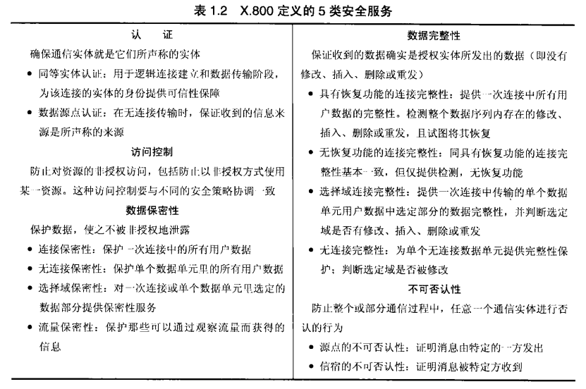
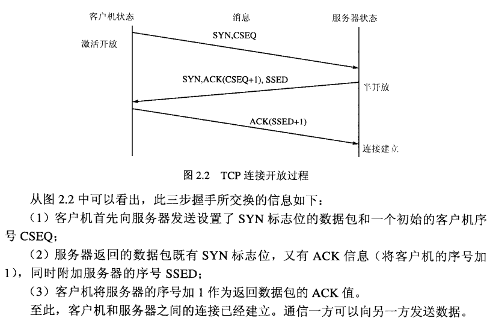
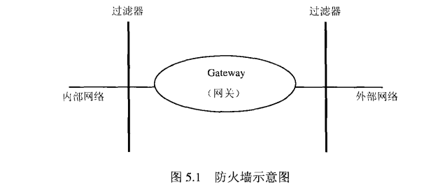
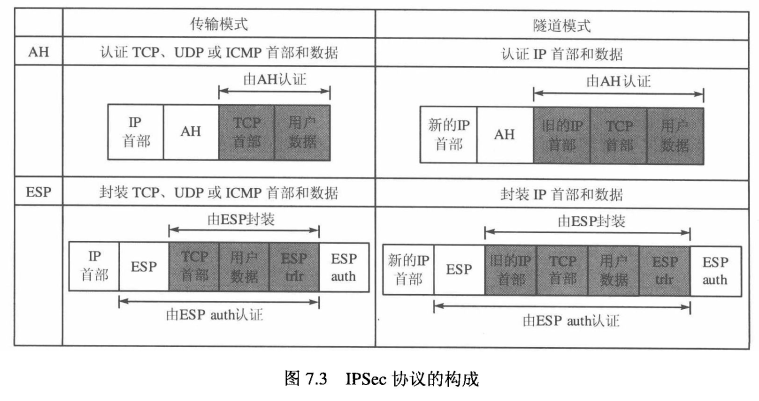

## 一、网络安全基础

### 1、 信息安全有以下三个基本目标

- **（1）保密性**：确保信息不会被泄露或呈现给非授权的人。

- **（2）完整性**：确保数据的一致性；特别要防止未经授权生成、修改或毁坏数据。

- **（3）可用性**：确保合法用户不会无缘无故地被拒绝访问信息或资源。

- **（4）合法使用**：确保资源不被非授权地人或者以非授权地方式使用。

### 2、四种基本安全威胁

信息泄露、完整性破坏、拒绝服务，非法使用。

### 3、安全防护措施

在安全领域，存在多种类型地防护措施。除了采用密码技术地防护措施外，还有其他类型的安全防护措施：

- **（1）物理安全**：包括门锁或其他物理访问控制措施、敏感设备的防篡改和环境控制等。

- **（2）人员安全**：包括对工作岗位敏感性的划分、雇员的筛选，同时也包括对人员的安全性培训，以增强其安全意识。

- **（3）管理安全**：包括对进出口软件和硬件设备的控制，负责调查安全泄露时间，对犯罪分子进行审计跟踪，并追查安全责任。

- **（4）媒体安全**：包括对受保护的信息进行存储，控制敏感信息的记录、再生和销毁，确保废弃的纸张或含有敏感信息的磁性介质被安全销毁。同时，对所用媒体进行扫描，以便发现病毒。

- **（5）辐射安全**：对射频及其他电磁辐射进行控制。

- **（6）生命周期控制**：包括对可信系统进行系统设计、工程实施、安全评估及提供担保，并对程序的设计标准和日志记录进行控制。

### 4、网络安全策略

所谓安全策略，是指某个安全域内，施加给所有与安全相关活动的一套规则。安全策略有几个不同的等级。

- **安全策略目标**：是一个机构对于所保护的资源要达到的安全目标而进行的描述。

- **机构安全策略**：是一套法律、规则及实际操作方法，用于规范一个机构如何管理、保护和分配资源，以便达到安全策略所规定的安全目标。

- **系统安全策略**：描述如何将一个特定的信息系统付诸工程实现，以支持此机构的安全策略要求。

### 5、授权

授权是安全策略的一个基本组成部分。所谓授权，是指主题对客体的支配权力，它规定了谁可以对什么做些什么。

### 6、访问控制策略

- 基于身份的策略。该策略允许或拒绝明确区分的个体或群体进行访问。

- 基于任务的策略。它是基于身份的策略的一种变形，它给每一个个体分配任务，并基于这些任务来使用授权规则。

- 多等级策略。它是基于信息敏感性的等级及工作人员许可等级而制定的一般规则的策略。

### 7、安全攻击

安全攻击分为两类：被动攻击和主动攻击。被动攻击试图获得或利用系统的信息，但不会对系统资源进行破坏。而主动攻击试图破坏系统的资源，影响系统的正常工作。

被动攻击：

- 窃听攻击

- 流量分析

主动攻击：

- 伪装攻击

- 重放攻击

- 消息篡改

- 拒绝服务

### 8、安全服务

### 9、网络安全模型

### 10、安全威胁与防护措施

所谓安全威胁，是指某个人、物、事件或概念对某一资源的保密性、完整性、可用性或合法使用所造成的危险。攻击就是某个安全威胁的具体实施。

## 二、TCP/IP协议族的安全性

### 1、IP（Internet Protocol）网际协议

- IP是一个不可靠的数据服务，它既不能保证数据包是否传送出去，也不能保证数据包仅传一次或以特定的次序传输，而且也不能对接收到的数据包进行正确性校验，IP头部中的校验和部分只是用于检验数据包IP头部的正确性，没有任何机制保证数据净荷传输的正确性。

- 每个小数据包可以经由不同的路径到达目的地，在传输的路途中，每个小数据包还会被继续分段，当这些小数据包到达目的机器时，他们会被重新重组到一起。按照规则规定，中间节点不能对小数据包拼装组合。

- IP不能保证数据一定是从数据包的源地址发送的。任意一台主机都能发送具有任意源地址的数据包。

- IPV4 的地址长度为32位，MAC的地址为48位，IPv6的地址长度为128位。

### 2、CIDR（Classless Inter-Domain Routing）：无分类域间路由

### 3、ARP（Address Resolution Protocol）地址解析协议

ARP的基本功能就是根据目标设备的IP地址查询目标设备的MAC地址。

### 4、TCP（Transmission Control Protocol）传输控制协议

**三步握手**

当TCP协议处于半开放状态时，攻击者可以成功利用SYN Flood 对服务器发动攻击。攻击者使用第一个数据包对服务器进行大流量冲击，使服务器进行大流量冲击，使服务器一直处于半开放连接状态。导致服务器无法完成三步握手协议。这样，服务器无法响应其他客户机发来的连接建立请求。

TCP数据包中包含序号和确认，所以未被顺序收到的数据包可以被排序。

### 5、UDP（USER Datagram Protocol）用户数据报协议

- 采用UDP传输数据没有纠错和重传机制

### 6、ICMP（Internet Control Message Protocol）Internet控制消息协议

- ICMP是一个低层通信机制，用来对 TCP 和 UDP 的连接行为产生影响。它可以用来通知主机到达目的地的最佳路由。报告路由故障，或者因路由故障中断某个连接。

- ICMP可以用来处理传输错误，当某个网关发现传输错误时，立即向信源主机发送ICMP报文，报告出错信息，让信源主机采取相应处理措施，它是一种差错和控制报文协议，不仅用于传输差错报文，还传输控制报文。

### 7、路由协议

- RIP（Routing Information Protocol）：路由信息协议

- OSPF（Open Shortest Path First）：优先开放最短路径协议

- BGP（Border Gateway Protocol）：边界网关协议

### 8、DHCP（Dynamic Host Protocol）动态主机配置协议

用来分配IP地址，并提供启动计算机（或唤醒一个新网络）的其他信息。

### 9、DNS（Domain Name System）域名系统：53号端口

- DNS 用来实现域名到IP地址或IP地址到域名的映射。

- DNS 使用两种不同类型的树，第一种树称作前向映像树，它将域名映射到IP地址，第二种树是用于反向查询的树，称作反向树，它将IP地址映射至域名。

### 10、NAT（Network Address Transfer）网络地址转换

### 11、电子邮件协议

- SMTP（Simple Mail Transfer Protocol）：简单邮件传输协议，25号端口

- POP3（Post Office Protocol）：邮件接收协议，110号端口

- IMAP（Internet Message Access Protocol）：Internet 消息访问协议，143号端口

- MIME（Multipurpose Internet E-Mail Extension）：多用途网际邮件扩充协议

### 12、TFTP（Trivial File Transfer Protocol）简单文件传输协议：UDP 67号端口

- 用来在客户机与服务器之间进行简单文件传输的协议，提供不复杂、开销不大的文件传输服务。

- TFTP承载在UDP上，提供不可靠的数据流传输服务，不提供存储授权和认证机制，使用超时重传方式来保证数据的到达。

### 13、FTP（File Transfer Protocol）文件传输协议

在TCP/IP中FTP标准命令采用的TCP端口号为21，Port方式数据端口为20

### 14、NFS（Network File System）网络文件系统

### 15、远程登陆协议

- Telnet 远程登陆协议。TCP 23号端口

- SSH（secure shell）安全壳协议，TCP 23号端口

### 16、SNMP（Simple Network Management protocol 简单网络管理协议

### 17、NTP（Network Time Protocol）网络时间协议

### 18、其他知识点

- DNS 将前向命名和后向命名分离，可能会带来安全问题。

- 与IPv4不同，IPv6头部中没有选项字段，某些可选的功能通过不同的拓展头部来实现，IPv6头部中没有校验和字段，去掉了与分段相关的字段，因为IPv6的基本头部长度是固定的，所以它取消了IPv4中的头部长度字段。

- IP协议规定中间节点不能对数据报分片进行重组，而IDS需要在内存中缓存所有的碎片，并模拟主机对碎片包进行重组。

## 三、数字证书与公钥基础设施

### 1、PKI（Public key infrastructure）公钥基础设施

公钥基础设施的目的是从技术上解决网上身份认证、电子信息的完整性和不可抵赖性等安全问题。

### 2、PKI的组成

- **CA：数字证书认证中心（认证中心）**

作为具有权威性、公正性的第三方可信任机构，是PKI体系的核心部件。CA负责发放和管理数字证书。

- **RA:注册机构（注册中心）**

是数字整数注册审批机构，是认证中心的延伸，与CA在逻辑上是一个整体，执行不同的功能。

- **证书发布库**

集中存放CA颁发证书和证书撤销列表（CRL，Certificate Revocation List）。

- 

**密钥备份与恢复**

- 

**证书撤销**

- 

**PKI应用接口**

### 3、PKI的应用

- 认证服务：即身份识别与认证，就是确认实体即为自己所声明的实体，鉴别身份的真伪。

- 数据完整性服务：就是确认数据没有被修改过。

- 数据保密性服务：PKI的保密性服务采用了“**数字信封**”机制。

- 不可否认服务：是指从技术上保证实体对其行为的认可。

- 公正服务。

### 4、数字信封

- 发送方先产生一个对称密钥，并用该对称密钥加密数据。

- 发送方还用接收方的公钥加密对称密钥，就像把它装入一个数字信封。

- 然后把被加密的对称密钥和被加密的敏感数据一起传送给接收方。

- 接收方用自己的私钥拆开数字信封并得到对称密钥。

- 用对称密钥解开被加密的敏感数据。

### 5、数字证书

- 数字证书实际上是一个计算机文件，该数字证书将建立用户身份与其所持公钥的关联。

- 数字证书就是一个用户的身份与其持有的公钥的结合，在结合之前由一个可信任的权威机构CA来证实用户的身份，然后由该机构对该用户身份及对应公钥相结合的证书进行数字签名，以证明其证书的有效性。

**数字证书字段**

### 6、注册机构提供的服务

- 接收与验证最终用户的注册信息

- 为最终用户生成密钥

- 接收与授权密钥备份与恢复请求

- 接收与授权证书撤销请求

### 7、数字证书的生成步骤

密钥生成->注册->验证->证书生成

### 8、CA 证书签名

在向用户签发数字证书前，CA首先要对证书的所有字段计算一个消息摘要，而后用CA私钥加密消息摘要,构成CA的数字签名。CA将计算出的数字签名作为数字证书的最后一个字段插入。

### 9、根 CA

- 根CA是验证链的最后一环，根CA自动作为可信任CA，根CA证书为自签名证书，即根CA对自己的证书签名。

- 数字证书分层机制使得根CA不必管理所有的数字证书。

### 10、交叉证书

由于实际中不可能有一个认证每一个用户的统一CA，因此要用分布式CA认证各个国家、政治组织与公司机构的证书。这种方式减少了单个CA的服务对象，同时确保CA可独立运作。

交叉证书主要是为了解决数字证书来源于不同根CA的问题。

### 11、数字证书撤销的原因

- 数字证书持有者报告该证书中指定公钥对应的私钥被破解（被盗）

- CA发现签发数字证书时出错

- 证书持有者离职，而证书为其在职时签发

### 12、证书撤销状态检查机制

**证书撤销列表CRL**：是脱机证书撤销状态检查的主要方法。最简单的CRL是由CA定期发布的证书列表，标识该CA撤销的所有证书。但该表中不包含过了有效期的失效期的失效证书。CRL中只列出有效期内因故被撤销的证书。每个CA签发自己的CRL，CRL包含相应的CA签名，易于验证。

**联机证书状态协议OCSP（Online Certificate Status Protocol）**：可以检查特定时刻某个数字证书是否有效，是联机检查方式。联机证书状态协议令证书检查者可以实时检查证书状态，从而提供更简单、快捷、有效的数字证书验证机制。与CRL不同，该方式无须下载证书列表。

**简单证书检验协议（SCVP，Simple Certificate Validation Protocol）**

### 13、PMI

PMI即权限管理基础设施或授权管理基础设施，是属性证书、属性权威、属性证书库等部件的集合体，用来实现权限和证书的产生、管理、存储、分发和撤销功能。

**AA（Attribute Authority）属性权威**：用来生成并签发属性证书（AC）的机构。它负责管理属性证书的整个生命周期。

**AC（Attribute Certificate）属性证书**：对于一个实体的权限绑定是由一个被数字签名了的数据结构来提供的，这种数据结构称为属性证书，由属性权威签发并管理。

### 14、PMI与PKI的关系

PKI和PMI之间的主要区别在于：PMI主要进行授权管理，证明这个用户有什么权限，能干什么，即“你能做什么”；PKI主要进行身份认证，证明用户身份，即“你是谁”。

### 15、其他知识点

- X.509标准规定了数字证书的结构与属性证书框架。

## 四、网络加密与密钥管理

### 1、三种常见的网络加密方式以及它们的优缺点

**链路加密**：链路加密需要在任意一对节点和相应调制解调器之间安装有相同的密码机。并配置相同的密钥，节点首先对接收到的消息进行解密，然后使用下一个链路的密钥对消息进行加密，因而系统开销较大。在链路加密方式下，在每一个中间传输节点上消息均被解密后重新加密，存在明文，报头是以密文形式传输的，需要对链路两端的加密设备进行同步。

**节点加密**：节点加密也需要在任意一对节点和相应调制解调器之间安装有相同的密码机，并配置相同的密钥，节点首先对接收到的消息进行解密，然后使用新的密钥对消息进行加密，因而系统开销也很大。但是节点加密不允许网络节点以明文形式存在，解密和加密的过程在安全模块中进行，但是报头是以明文形式传输的，需要对加密设备进行同步。

**端到端加密**：端到端加密仅需要每对用户采用相同的密码算法和密钥，传送通路上各中间节点数据是保密的，因而系统开销较小，由于中间节点不存在解密，因而中间节点无明文存在，但是由于端到端加密不允许对消息的目的地址加密，因而该部分明文可能被用于流量分析，端到端加密避免了系统同步的问题。

**混合加密**：采用端到端加密方式只能对报文加密，报头是以明文形式传送，容易受到业务流量分析攻击。为了保护报头中的敏感信息，可以采用端到端和链路混合加密方式。在此方式下，报文将被两次加密，而报头则只由链路方式进行加密。

### 2、密钥的种类

### 3、好的密钥

（1）真正随机、等概率，如掷硬币、致骰子等。
（2）避免使用特定算法的弱密钥。
（3）双钥系统的密钥更难以产生，因为必须满足一定的数学关系。
（4）为了便于记忆，密钥不能选得过长，而且不可能选完全随机的数串，要选用易记而难猜中的密钥。
（5）采用密钥揉搓或杂凑技术，将易记的长句子（10~15个英文字的通行短语），经单向杂凑函数转换成伪随机数串（64位）。

### 4、密钥分配的方法

- 利用安全信道实现密钥传递

- 利用双钥体制建立安全信道传递

- 利用量子技术实现密钥传递

### 5、密钥分配系统的基本模式

**点对点密钥分配**

由A直接将密钥送给B，利用A与B的共享基本密钥加密实现。

**密钥分配中心KDC**

A向KDC请求发放与B通信用的密钥，KDC生成k传给A，并通过A传递给B，或KDC直接传递给B，利用A与KDC和B与KDC的共享密钥实现。

**密钥转递中心KTC**

A将与B通信用的会话密钥k送给KTC，KTC再通过A转递给B，或KTC直接转送给B，利用A与KTC和B与KTC的共享密钥实现。

### 6、可信第三方TTP

当A和B属于不同的安全区域时，协调方式特别重要。证书发放管理机构常采用脱机方式。脱机方式对计算资源的要求较低，但在撤销权宜上不如其他两种方式方便。

### 7、密钥交换协议

（1）采用单钥体制的密钥建立协议

此协议的安全性完全依赖于Trent的安全性。Trent可能是一个可信的通信实体，也可能是一个可信的计算机程序。如果攻击者买通了Trent，那么整个网络的机密就会泄露。该协议存在的另一个问题是：Trent可能成为影响系统性能的瓶颈，因为每次进行密钥交换时，都需要Trent的参与。如果Trent出现故障，就会影响整个系统的正常工作。

（2）采用双钥体制的密钥交换协议（不能抵御中间人攻击）

（3）联锁协议（能够抵御中间人攻击）

（4）采用数字签名的密钥交换（能够抵御中间人攻击）

### 8、密钥的有效期

## 五、防火墙原理与设计

### 1、防火墙概述

-  防火墙是由软件和硬件组成的系统，它处于安全的网络和不安全的网络之间，根据由系统管理员设置的访问控制规则，对数据流进行过滤。 

-  防火墙对数据流的处理方式有三种： 

- 允许数据流通过

- 拒绝数据流通过

- 将这些数据流丢弃

-  由于防火墙是放置在两个网络之间的网络安全设备，因此必须满足以下要求： 

- 所有进出网络的数据流都必须经过防火墙

- 只允许经过授权的数据流通过防火墙

- 防火墙自身对入侵是免疫的

### 2、防火墙的构成

外部过滤器用来保护网关免受侵害，而内部过滤器用来防备因网关被攻破而造成恶果。防火墙都有三个或三个以上的接口，同时发挥了两个过滤器和网关的功能。

### 3、防火墙的分类

- 静态包过滤

- 动态包过滤

- 电路级网关

- 应用级网关

- 状态检查包过滤

- 切换代理

- 空气隙

一般来说，防火墙工作于OSI模型的层次越高，其检查数据包中的信息就越多，因此防火墙所消耗的处理器工作周期就越长；防火墙检查的数据包越靠近OSI模型的上层，该防火墙结构索提供的安全保护等级就越高，因此在高层上能够获得更多的信息用于安全决策。

### 4、静态包过滤防火墙

静态包过滤防火墙采用一组过滤规则对每个数据包进行检查，然后根据检查结果确定是转发还是丢弃该数据包。

静态包过滤防火墙主要实现三个主要功能：

- 接收每个到达的数据包

- 对数据包采用过滤规则，对数据包的IP头和传输字段内容进行检查。如果数据包的头信息与一组规则相匹配，则根据该规则确定是转发还是丢弃该数据包。

- 如果没有规则与数据包头信息匹配，则对数据包施加默认规则。

静态包过滤防火墙工作在**网络层**，对于静态包过滤防火墙来说，决定接收还是拒绝一个数据包，取决于数据包中IP头和协议头等特定域的检查和判定。这些特定域包括

- 数据源地址

- 目的地址

- 应用或协议

- 源端口号

- 目的端口号

**静态包过滤防火墙的优缺点**

### 5、动态包过滤防火墙

静态包过滤防火墙的规则表是固定的，而动态包过滤防火墙可以根据网络当前的状态检查数据包，即根据当前所交换的信息动态调整过滤规则表。

动态包过滤防火墙是在静态包过滤防火墙的基础上发展而来的。最大的不同是动态包过滤防火墙具有“状态感知”的能力。

典型的动态包过滤防火墙也和静态包过滤防火墙一样，都工作在网络层，动态包过滤防火墙所检查的数据包头信息包括：

- 数据源地址

- 目的地址

- 应用或协议

- 源端口号

- 目的端口号

**动态包过滤防火墙的优缺点**

对于静态/动态包过滤防火墙，因为防火墙对规则的检查是按顺序进行的，所以决定包过滤规则的先后顺序是一项很困难的事情。

### 6、电路级网关

电路级网关又称作线路级网关，当两个主机首次建立TCP连接时，电路级网关在两个主机之间建立一道屏障。电路级网关的作用就好像是一台中继计算机，用来在两个连接之间来回的复制数据，也可以记录或缓存数据。

电路级网关工作于会话层，即OSI模型的第五层。电路级网关检查的数据包括：

- 源地址

- 目的地址

- 应用或协议

- 源端口号

- 目的端口号

- 握手信息及序列号

**电路级网关的优缺点**

### 7、应用级别网关

应用级网关只对特定服务的数据流进行过滤。必须为特定的应用服务编写特定的代理程序。这些程序被称为“服务代理”，在网关内部分别扮演客户机代理和服务器代理的角色。当各种类型的应用服务通过网关时，他们必须经过客户机代理和服务器代理的过滤。

**工作原理**

**应用级网关的优缺点**

### 8、状态检测防火墙

状态检测技术采用的是一种基于连接的状态检测机制，将属于同一连接的所有包作为一个数据流的整体看待，构成连接状态表，通过规则表和状态表的共同配合，对表中的各个连接因素加以识别。

状态检测防火墙可以在OSI模型的所有7个层次上进行过滤。

### 9、切换代理

切换代理实际上是动态包过滤器和一个电路级代理的结合。在许多实现方案中，切换代理首先起电路级代理的作用，以验证三步握手，然后再切换到动态包过滤的工作模式下。因此切换代理首先工作于OSI的会话层，当连接完成后，再切换到动态包过滤模式，即网络层。

**切换代理的优缺点**

切换代理具有以下优点：

- 与传统的电路级网关相比，它对网络性能造成的影响要小。

- 由于对三步握手进行了验证，所以降低了IP欺骗的风险。

切换代理具有以下优点：

- 它不是一个电路级网关。

- 它仍然具有动态包过滤器遗留的许多缺陷。

- 由于没有检查数据包的净荷部分，因此具有较低的安全性。

- 难于创建规则。

- 其安全性不及传统的电路级网关。

## 六、入侵检测系统

### 1、通用的入侵检测系统模型由4个部分组成

### 2、IDS的任务

- 信息收集

- 信息分析

- 安全响应

IDS信息分析的主要方式：

- 模式匹配：模式匹配技术即模式发现技术。就是将收集到的信息与已知的网络入侵模式的特征数据库进行比较，从而发现违背安全策略的行为。

- 统计分析：假定所有入侵行为都与正常行为不同，如果能建立系统正常运行的行为轨迹，那么就可以将所有与正常轨迹不同的系统状态视为可疑的入侵企图。

- 完整性分析：完整性分析检测某个文件或对象是否被更改。

### 3、入侵检测原理及主要方法

IDS通常使用两种基本的分析方法来分析事件、检测入侵行为，即**异常检测**和**误用检测**。

**异常检测**

异常检测技术又称为基于行为的入侵检测技术，用来识别主机或网络中的异常行为。它假设攻击与正常的（合法的）活动有明显的差异。

**误用检测**

误用检测技术又称为基于知识的检测技术。它假定所有入侵行为和手段（及其变种）都能表达为一种模式或特征。

### 4、入侵检测步骤

入侵检测一般分为三个步骤：信息收集、数据分析和响应（被动响应和主动响应）。

主动响应：阻止攻击或影响，从而改变攻击的过程

被动响应：报告和记录所检测出的问题

入侵检测系统可以用来防御来自网络内部和网络外部的攻击

### 5、IDS的结构

一个入侵检测系统分为以下组件：

- 事件产生器

- 事件分析器

- 响应单元

- 事件数据库

### 6、IDS的分类

**按照数据来源分类**

- 基于网络的入侵检测系统（NIDS），数据来源于网络上的数据流。

- 基于主机的入侵检测系统（HIDS），数据来源于主机系统，通常是系统日志和审计记录。

- 采用上述两种数据来源的分布式入侵检测系统（DIDS）。

**按照入侵检测策略分类**

- 滥用检测：将收集到的信息与已知的网络入侵和系统误用模式数据库进行比较，从而发现违背安全策略的问题。

- 异常检测：首先给系统对象创建一个统计描述、统计正常使用时的一些测量属性。测量属性的平均值将被用来与网络、系统的行为进行比较，如果观察值在正常范围之外，就认为有入侵发生。

- 完整性分析：主要关注某个文件或对象是否被更改，这通常包括文件和目录的内容及属性。

### 7、NIDS

**NIDS关键技术**

- IP碎片重组技术

- TCP流重组技术

- TCP状态检测技术

- 协议分析技术

- 零复制技术

- 蜜罐技术

蜜罐是一个吸引潜在攻击者的陷阱，它的作用是：

- 把潜在攻击者的注意力从关键系统移开

- 收集入侵者的动作信息

- 设法让攻击者停留一段事件，使管理员能检测到它并采取相应的措施。

### 8、HIDS

基于主机的入侵检测系统有如下特点：

-  监视特定的系统活动 

- 监视用户和访问文件的活动

- 监视只有管理员才能实施的异常行为

- 监视主要系统文件和可执行文件的改变

-  非常适用于加密和交换环境 

-  近实时的检测和应答 

-  不需要额外的硬件 

### 9、DIDS

采用分布式入侵检测系统DIDS的原因：

- 系统的弱点或漏洞分散在网络的各个主机上，这些弱点有可能被入侵者一起用来攻击网络，而依靠唯一的主机或网络，IDS不能发现入侵行为。

- 入侵行为不再是单一的行为，而表现出协作入侵的特点

- 入侵检测所依靠的数据来源分散化，收集原始数据变得困难。

- 网络传输速度加快，网络的流量大，集中处理原始数据的方式往往造成检测瓶颈，从而导致漏检

## 七、VPN 技术

### 1、VPN的概念

所谓虚拟专网（VPN，Virtual private Network），是指物理上分布在不同地点的网络通过公用网络连接而构成逻辑上的虚拟子网。

### 2、VPN的分类

- **远程访问VPN**：移动用户远程访问VPN连接，由远程访问的客户机提出连接请求，VPN服务器提供对VPN服务器或整个网络资源的访问服务。

- **网关-网关VPN**：网关-网关VPN连接，由呼叫网关提出连接请求，另一端的VPN网关做出响应。

### 3、VPN关键技术

**（1）隧道技术**

隧道技术是VPN的基本技术，它在公用网上建立一条数据通道（隧道），让数据包通过这条隧道进行传输。

- 第二层隧道协议：L2F、PPTP、L2TP（主要用于构建远程访问VPN）

- 第三层隧道协议：IPSec、GRE、MPLS（主要用于构建LAN-to-LAN 型的VPN）

**（2）加解密技术**

**（3）密钥管理技术**

**（4）身份认证技术**

**（5）访问控制**

### 4、IPSec VPN

IPSec 主要协议：

-  认证首部协议 AH（Authentication Header） 

- AH只涉及认证，不涉及加密，AH的安全参数索引子域用于唯一标识该IP数据包认证。

-  封装净荷安全协议 ESP（Encapsulating Security payload） 

-  Internet 密钥交换协议 IKE（Internet Key Exchange） 

- IKE可以动态的建立安全关联和共享密钥。

IPSec 协议由AH和ESP提供了两种工作模式。这两种协议可以组合起来使用。

**IPSec VPN的构成**

- 管理模块

- 密钥分配和生成模块

- 身份认证模块

- 数据加解密模块

- 数据分组封装/分解模块

- 加密函数库

### 5、SSL/TLS VPN

**TLS VPN的优点**

- 无需安装客户端软件，只需要标准的Web浏览器。

- 适用于大多数设备

- 适用于大多数操作系统

- 支持网络驱动器访问

- TLS不需要对远程设备或网络做任何改变

- 较强的资源控制能力

- 费用低且具有良好的安全性

- 可以绕过防火墙和代理服务器进行访问，而IPSec VPN很难做到这一点。

- TLS加密已经内嵌在浏览器中，无须增加额外的软件。

## 八、身份认证

### 1、身份证明系统的组成

- 示证者P（Prover）：又称作申请者，他提出某种入门或入网请求。

- 验证者V（Vertifier）：检验示证者出示证件的正确性和合法性，决定是否满足其要求。

- 攻击者：它可以窃听并伪装示证者骗取验证者的信任。

- 认证系统在必要时也会有可信者，他的作用是参与调解纠纷。

### 2、身份证明可分为两大类

- 身份验证：它要回答：你是否是你所声明的你

- 身份识别：它要回答：我是否知道你是谁

### 3、身份证明的基本途径

- 所知：个人所知道的或所掌握的知识

- 所有：个人所具有的东西

- 个人特征

身份证明系统以合法用户遭拒绝的概率（即拒绝率或虚报率（I型错误率））和非法用户伪造身份成功的概率（即漏报率（Ⅱ型错误率））作为服务质量评价标准。

### 4、口令的选择原则

- 容易记忆

- 难以被别人猜中或发现

- 能够抵御蛮力破解分析

### 5、口令的控制措施

### 6、Unix系统中的口令存储

口令为8个字符，采用7 bit ASCII码，即56bit串。

### 7、一次性口令认证

**挑战/响应机制**

在挑战响应机制中，不确定因素来自认证服务器，用户要求登陆时，服务器产生一个随机数（挑战信息）发送给用户；用户用某种单向函数将这个随机数进行杂凑后，转换成一个密码，并发送给服务器。服务器用同样的方法进行验算即可验证身份的合法性。

**口令序列机制**

口令序列机制是挑战/响应机制的一种实现。

**时间同步机制**

基于时间同步机制的令牌把当前时间作为不确定因素，从而产生一次性口令。

**事件同步机制**

又称为计数器同步机制。基于事件同步的令牌将不断变化的计数器作为不确定因素，从而产生一次性口令。

## 九、其他

### 1、简述PPDR模型的四个部分安全策略

PPDR 是安全策略，防护，检测和响应

- 策略（policy）：根据风险分析产生的安全策略，描述了系统中哪些资源要得到保护，以及如何实现对它们的保护等。

- 防护（protection）：修复系统漏洞，正确设计开发和安装系统；定期检查发现可能存在的系统脆弱性，正确使用系统；访问控制，监视来放置恶意威胁。

- 检测（detection）：检测是动态响应和加强防护的依据，也是强制落实安全策略的有力工具，通过不断检测和监控网络和系统。来发现新的威胁和弱点，通过循环反馈来及时做出有效的响应。

- 响应（respond）：在安全系统中占有最重要的地位，是解决安全潜在性问题最有效的方法，从某种意义上讲，安全问题就是解决紧急响应和异常处理问题。

### 2、电子邮件安全问题

**安全电子邮件系统通常提供以下服务**

- 信息机密性：保证只有指定的接收方才能阅读信息

- 信息完整性：保证发出的信息与接收到的信息一致

- 认证：确保信息源的正确性

- 不可否认性：防止发送者抵赖，否认所发送的信息；防止接收者抵赖，否认所接收的信息。

**电子邮件的安全问题**

- 电子邮件病毒

- MIME标题头中的恶意代码

- 电子邮件炸弹

- 垃圾邮件