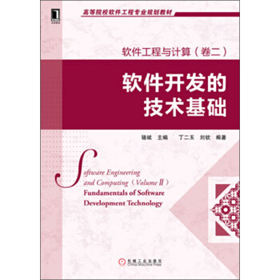

## 封面

 

## 第一、二章 软件工程基础

### 1、什么是软件

- 软件独立于硬件。
- 软件是一种工具。
- 软件以程序代码为核心，由程序、文档、数据三个部分组成。
- 软件开发远远比编程复杂。
- 应用软件基于现实又高于现实。

### 2、软件工程定义

- （一）、应用系统的、规范的、可量的方法来开发、运行、维护软件，即将工程应用到软件。
- （二）、对（一）中各种方法的研究

### 3、软件以程序代码为核心、由三个部分组成

- 程序，机器指令的集合
- 文档。描述程序操作与使用的文档
- 数据，程序运行时需要使用的信息。

### 4、软件开发活动

包括需求开发、软件设计、软件构造、软件测试、软件交付与维护等具体活动。

## 第四章 项目管理基础

### 1、项目的定义

项目是具有下列特征的一系列活动和任务

- 具有一个明确的目标；
- 有限定的开始和结束日期；
- 有成本限制；
- 消耗人力和非人力资源；
- 多工种合作。

### 2、项目管理的目标

- 限定的时间
- 限定的成本
- 要求的质量水平
- 高效资源使用
- 客户的认可。

### 3、团队的特征

[Katzenbach1993]将团队定义为：为了⼀致的目的、绩效标准、⽅法⽽共担责任并且技能互补的少数⼈。

- 团队成员要具备共同的目标。
- 团队成员要共担责任。
- 团队成员要技能互补。
- 团队内部要有⼀个明确的结构。

### 4、团队结构

- **主程序员团队**:即有一名技能能力出色的程序员领导团队完成任务，主程序员负责总体构思设计，然后分配任务给其他团队成员，并监督、验收和整合其他成员的工作完成情况。(缺点:如果项目过大，主程序员能力成为瓶颈，团队成员主动性低 优点:工作效率高)
- **民主团队**:项目经理负责管理，围绕着项目的计划进行，没有明确的人作为技术领导，所有团队成员都可以在各自擅长的领域担任技术领导。(缺点:交流成本高，容易陷入思想混乱。 优点:团队主动性高)
- **开放团队**:团队的成员都是有创造性的产品开发者，团队可以按照自己认为合适的方式进行自我管理。(缺点:项目进展与创新没有可视度 优点:创造性高)

### 5、团队建设

- 建立团队章程
- 持续成功
- 和谐沟通
- 避免团队杀手

### 6、质量验证的方法

- 评审:由作者之外的其他人来检查产品问题
- 测试
- 质量度量:用数字量化的方式描述软件产品。

### 7、质量模型

一些能够相互配合、相互联系的质量属性的特征集。常见的特征(质量属性):

- 功能性
- 可靠性
- 易/可用性
- 效率
- 可维护性
- 可移植性 。

### 8、质量保障各阶段的活动

- 需求开发阶段:1.需求评审。2.需求度量。
- 建立体系结构阶段:1.体系结构评审。2.集成测试。
- 详细设计阶段:1.详细设计评审。2.设计度量。3.集成测试。
- 实现(构造)阶段:1.代码评审。2.代码度量。3.测试。
- 测试阶段:1.测试。2.测试度量。

### 9、配置管理

概念：用技术的和管理的指导和监督方法，来标识和说明配置项的功能和物理特征，控制对这些特征的变更，记录和报告变更处理及其实现状态，并验证与规格需求的一致性。

### 10、配置项：

置于软件配置管理之下的软件配置的各种有关项目，包括各类管理文档、评审记录与文档、软件文档、源码及其可执行码、运行所需的系统软件和支持软件以及有关数据。

### 11、基线

已经经过正式评审的规格说明或制品，可以作为进一步开发的基础，并且只有通过正式的变更控制过程才能变更。

### 12、软件配置管理有哪些活动:

- 标识配置项:1.给配置项确定唯一标识  2.说明配置项的特征如生产者、基线建立时间、使用者
- 版本管理:1.变更时更新版本号 2.管理不同的分支
- 变更控制:依据变更过程进行配置
- 配置审计:确定项目满足需求的功能和物理特征的程度
- 状态报告:标识、手机和维持演化中的配置状态信息
- 软件发布管理:创建和发布可用的产品如交付可执行程序、使用文档、注意事项等。

### 13、软件配置管理的动机

- 在软件开发过程中，除了最终产品之外，还会产生很多中间制品，这些制品是不同阶段、不同角色、不同软件开发活动进行协同的基础
- 在复杂软件系统开发中，产生的制品数量众多，以至于开发者需要维护一个清单才能清楚项目所处的状态，理解已经完成的工作和将要进行的工作。
- 某个制品发生变化带来的最大挑战是如何确保其使用者能够得到最新的制品，避免开发协同出现问题

### 14、变更控制

变更控制就是以可控、一致的方式进行变更处理，包括对变化的评估、协调、批准和拒绝、实现和验证。变更控制并不是限制甚至拒绝变化，它是以一种可控制的严格的方式来执行变更。

## 第五章 软件需求基础

### 1、需求的定义

- ⑴用户为了解决问题或达到某些目标所需要的条件或能力；
- ⑵系统或系统部件为了满足合同、标准、规范或其它正式文档所规定的要求而需要具备的条件或能力；
- ⑶对⑴或⑵中的一个条件或一种能力的一种文档化表述。

### 2、为什么要开发需求

需求开发是软件工程的起始阶段，设计、实现等后续阶段的正确性都以它的正确性为前提、如果需求开发过程中有错误未能解决，则其后的所有阶段都会受到影响。所以进行严谨的需求开发是非常重要的。

### 3、获取需求的方法

- 面谈:问答
- 集体获取方法:通过用户们的讨论发现需求，如专题讨论会
- 头脑风暴:特殊的群体面谈方法。
- 原型:通过一个有形的制品来增进用户和需求工程师之间的交流。

### 4、需求层次

- 业务需求：抽象层次最高的需求称为业务需求，系统建⽴的战略出发点，表现为⾼层次的目标，它描述了组织为什么要开发系统
- 用户需求：用户需求是执⾏实际⼯作的⽤户对系统所能完成的具体任务的期望，描述了系统能够帮助⽤户做些什么。
- 系统级需求：系统级需求是⽤户对系统⾏为的期望，每个系统级需求反映了⼀次外界与系统的交互⾏为，或者系统的⼀个实现细节。

### 4、需求、问题域、规格说明三者的区别与联系:

-  区别: 
   - 需求:需求是用户的一种期望。源于现实又高于现实
   - 问题域:是现实世界运行规律的一种反映。是需求的产生地也是解决地。最终的软件产品要在现实中部署，它能够部分影响问题域，但不能任意改变现实。
   - 规格说明:软件产品的⽅案描述，它以软件产品的运⾏机制为主要内容。它不是需求但实现需求，不是问题域但需要与问题域互动
-  联系:是进行需求开发的三个重要内容，如果忽视需求，则软件系统只是单纯模拟现实而不是改变现实，丢失了软件产品的价值。如果忽视问题域，则软件系统脱离现实，无法得到应用。规格说明本质上是对需求以及问题域的吸纳 

### 5、需求分类

### 6、软件需求的类型

- 功能需求:和系统主要工作相关的需求。
- 性能需求:一个系统或者其组成部分在限定的约束下，完成其制定功能的程度，例如速度、内存使用程度。
- 质量属性:隐式的需求。分为可靠性、可用性、安全性、可维护性、可移植性、易用性等。
- 对外接口:指系统和环境中其他系统之间需要建立的接口。需要说明接口用途、输入输出、数据命令格式以及异常处理要求。
- 约束:指系统构造时需要遵守的约定。常见的包括系统开发以及运行环境、问题域内的相关标准和商业规则。
- 数据需求:并不算标准的软件需求类别。但常用与于数据库、文件等存储数据的描述

## 第六章 需求分析方法

### 1、为什么需要需求分析？

需求获取中得到的信息仅仅解释了用户对软件系统的期待，它们还不是开发者能够立即加以实现的解决方案，而且，开发者与用户具有不同的知识背景，他们无法从获取信息中轻易的把握用户的真实意图，为其创建软件解决方案就更无从谈起了。所以需求工程师需要在需求获取之后进行需求分析，以解决信息与软件系统解决方案之间的差距。

### 2、需求分析的任务

- 建立分析模型，达成开发者和用户对需求信息的共同理解。
- 依据共同的理解，发挥创造性，创建软件系统解决方案。

### 3、常见的数据分析模型

- 结构性方法：数据流图、实体关系图
- 面向对象方法：用例图、概念类图(分析类图)、系统顺序图、状态图

## 第七章 需求文档与验证

### 1、文档化的原因

子任务与人员之间存在着复杂的关系，存在大量的沟通和交流。所以软件系统开发中需要编写多种不同类型的文档，每种文档都针对项目中需要进行广泛交流的内容。

### 2、技术文档要点

简洁、精确、易读（查询）、易修改。

### 3、需求书写要点

使用用户术语、可验证、可行性。

## 第八章、软件设计基础

### 1、软件设计

软件设计是关于软件对象的设计，是一种设计活动，自然具有设计的普遍特征，软件设计既指软件对象实现的规格说明，也指产生这个规格说明的过程。

### 2、软件设计的核心思想

**抽象和分解是软件设计的核心思想**。

- 分解是横向上将系统分割为几个相对简单的子系统以及各子系统之间的关系。分解之后每次只需关注经过抽象的相对简单的子系统及其相互之间的关系，从而降低了复杂度。
- 抽象则是在纵向上聚焦各子系统的接口。这里的接口和实现相对，是各子系统之间交流的契约，是整个系统的关键所在、本质所在。抽象可以分离接口与实现，让人更好的关注系统本质，从而降低复杂度。
- 分解与抽象一般是一起使用的，比如我们既将系统分解为子系统，又通过抽象分离接口与实现。

## 第九章、软件体系结构基础

### 1、软件体系结构

一个软件系统的体系结构规定了系统的计算部件和部件之间的交互。由部件+连接件+配置组成。部件：是软件体系结构的基本组成单位之一，承载系统的主要功能，包括处理与数据。连接件：是软件体系结构的另一个基本组成单位，定义了部件之间的交互，是连接的抽象表示。配置：是对“形式”的发展，定义了“部件以及“连接件”之间的关联方式，将它们组成成系统的总体结构。

### 2、体系结构风格优缺点

- 主程序/子程序: 该风格是基于部件与连接件建立的高层结构，其部件不同于程序，而是更加粗粒度的模块。主程序是系统的控制器，负责调度子程序的执行，各子程序又是一个局部的控制器，负责调度子子程序的执行。优点:流程清晰，易于理解。强控制性。缺点:程序调用是一种强耦合的连接方式，难以修改和复用。程序调用的连接方式限制了各部件的数据交互。
- 面向对象式:该风格将系统组织为多个独立的对象，每个对象封装其内部的数据，并基于数据对外提供服务，不同对象之间通过协作机制共同完成系统任务。优点:内部实现的可修改性。易开发、易理解、易复用的结构组织。缺点:无法消除接口的耦合。标识耦合。面向对象编程中的副作用。
- 分层风格:根据不同的抽象层次将系统组织为层次式结构，每个层次被建立为一个部件，不同部件之间通常用程序调用方式进行连接，优点:设计机制清晰易于理解。支持并行开发。更好的可复用性和内部可修改性。缺点:交互协议难以修改。性能损失。难以确定层次数量和粒度。
- MVC:该风格以程序调用为连接件，将系统功能组织为模型、视图、控制三个部件。其中模型封装了系统的数据和状态信息，提供数据服务和执行业务逻辑;视图封装了用户交互，提供业务展现；控制封装了系统控制逻辑，根据用户行为调整系统状态以及业务展现。 优点:易开发性。视图的控制和可修改性。适宜于网络系统开发的特征。缺点:复杂性。模型修改困难。

## 第十章、软件体系结构设计与构建

### 1、包的创建原则

逻辑设计中的每个包对应一个开发包。

### 2、体系结构设计的过程

- 分析关键需求和项目约束
- 选择体系结构风格
- 进行软件体系结构逻辑(抽象)设计
- 依赖逻辑设计进行软件体系结构实现物理(实现)设计
- 完善软件体系结构设计
- 定义构件接口
- 迭代过程 ③—⑥。

### 3、体系结构集成与策略

集成的策略：

- 大爆炸集成：大爆炸集成就是将所有的模块一次性组合在一起。其优点是可以在短时间内迅速完成集成测试。

增量式

-  自顶向下集成：自顶向下集成是对分层次的架构，先集成和测试上层的模块，下层的模块使用伪装的具有相同接口的桩（stub）。然后不断地加入下层的模块，再进行测试，直到所有的模块都被集成进来，才结束整个集成测试。 
-  自底向上集成：与自顶向下集成顺序相反，是从最底层的模块集成测试起，测试的时候上层的模块使用伪装的相同接口的驱动来替换。 
-  集成测试： 一种增量集成⽅方法,但它提倡尽早集成和频繁集成。 
   - 尽早集成是指不需要总是等待一个模块开发完成才把它集成起来,⽽是在开发之初就利用 Stub 集成起来。
   - 频繁集成是指开发者每次完成一些开发任务之后,就可以用开发结果替换 Stub 中的相应组件,进行集成与测试。一般来说,每人每天至少集成一次,也可以多次。

### 4、什么是桩Stub和驱动Driver

- 桩:主要用于自顶向下集成策略中，即先集成和测试上层的模块，下层的模块使用伪装的具有相同接口的桩，其模拟地实现了模块的简单行为。
- 驱动:主要用于自底向上集成，从底层的模块集成起，测试的时候上层的模块使用伪装的相同接口的驱动。

## 第十一章、人机交互设计

### 1、可用性(易用性)

- 易用性包括易学性、易记性、效率、出错率和主观满意度。
- 易学性是指新手用户容易学习，能够很快使用系统
- 易记性是指以前使用过软件系统的用户能有效记忆或者快速的重新学会使用该系统。
- 效率是指熟练用户使用系统完成任务的速度
- 出错率是指用户使用系统时，会犯多少错，错误有多严重，以及能否从错误中很容易地恢复。
- 主观满意度是让用户有良好的体验。

### 2、精神模型

精神模型就是用户进行人机交互时头脑中的任务模型。人机交互设计需要依据精神模型进行隐喻设计。

### 3、人机交互设计原则

- 简洁设计:不要使用太大的菜单，不要在一个窗口中表现过多的信息类别，不要在一个表单中使用太多的颜色和字体作为线索。
- 一致性设计:遵循用户已有的精神模型。
- 低出错率设计:避免可能用户操作可能引起的错误并且提供简洁的指导帮助用户消除错误。
- 易记性设计:减少用户记忆负担。
- 导航:提供一个很好的完成任务的入口。
- 反馈:提示用户交互行为的结果，但不打断用户工作的意识流。⑦不暴露软件系统内部构造机制。
- 协作式设计:调整计算机因素以更好地适应并帮助用户的设计方式。

### 4、使用图形界面的好处

- 使电脑置于用户控制之下
- 缩短了学习的时间
- 使用过程中可以得到良好反馈
- 错误容易被发现并更正。

### 5、低出错率设计4个简单原则：

- 应当使用清晰的语言来表达，而不要使用难懂的代码
- 使用的语言应当精炼准确，而不是空泛、模糊的
- 应当对用户解决问题提供建设性的帮助
- 出错信息应当友好，不要威胁或责备用户

### 6、易记性设计常用方法：

- 减少短期记忆负担
- 使用逐层递进的方式、展示信息
- 使用直观的快捷方式
- 设置有意义的默认值

## 第十二章、详细设计的基础

### 1、详细设计出发点

软件详细设计应该在软件体系结构设计之后进行，以需求开发的结果和软件体系结构的结果为出发点。

### 2、协作的测试（Mock Object）

类之间的桩程序通常被称为Mock Object，不同于stub类型桩程序。Mock的测试代码更简单。

## 第十三章、模块化与信息隐藏

### 1、高内聚低耦合

每个模块的内部有最大的关联,模块之间有最小的关联。

### 2、耦合(六种耦合)

描述了两个模型之间关系的复杂程度。

- 内容耦合:一个模块直接修改或者依赖于另一个模块的内容。(无法接受)
- 公共耦合:模块之间共享全局的数据。(无法接受)
- 重复耦合:模块之间有同样逻辑的重复代码。(无法接受)
- 控制耦合:一个模块给另一个模块传递控制信息。
- 印记耦合:共享一个数据结构，但是却只用了其中一部分。
- 数据耦合:两个模块的所有参数是同类型的数据项。

记忆：数据的印记控制重复的公共内容。

### 3、内聚(七种内聚)

描述了一个模块内部联系的紧密性。

- 偶然内聚:模块执行多个完全不相关的操作。(无法接受)
- 逻辑内聚:模块执行一系列相关操作，但是每个操作的调用由其他模块来决定。(无法接受)
- 时间内聚:模块执行一系列与时间有关的操作。
- 过程内聚:模块执行一系列与步骤顺序有关的操作。
- 通信内聚:模块执行一系列与步骤有关的操作，并把这些操作在相同的数据上进行。
- 功能内聚:模块只执行一个操作或者达到一个单一目的。
- 信息内聚:模块进行许多操作，入口点独立，每个操作的代码独立，但使用相同的数据结构。

记忆：信息的功能是通信的过程，时间会证明逻辑是偶然的。

### 4、信息隐藏的基本思想

每个模块都隐藏一个重要的设计决策，即每个模块都承担一定的职责(功能实现)，对外表现为一份契约(接口)

## 第十四、十五章 面向对象的详细设计

**耦合**

### 1、降低访问耦合的方法

- 接口分离原则/接口最小化：将一个统一的接口匹配为多个更独立的接口。
- 迪米特法则：一个软件实体应当尽可能少地与其他实体发生相互作用。

### 2、降低继承耦合的方法

- 里氏替换原则（Liskov、LSP）：子类型必须能够替换掉基类型而起同样的作用。
- 使用组合替代继承：在希望复用代码又不能满足LSP时，往往会使用组合来代替继承，用继承的时候一定要符合LSP，不要只为了代码复用而使用继承.

**内聚**

### 1、面向对象中的内聚有不同的类型：

- 方法的内聚：和结构化中的函数内聚一致，主要是体现方法实现语句之间的内聚性。
- 类的内聚：主要是衡量成员变量和方法之间的内聚。类既应该是信息内聚的，又应该是功能内聚的。类内聚的典型情况有：①方法和属性是否一致。②属性之间是否体现一个职责。③属性之间可否抽象。
- 子类与父类的继承内聚：考虑的则是继承树中类之间的内聚。如果这些类只是为了代码重用将无关的类放入继承树中，则类之间的继承内聚性就比较低。如果类之间具有很好的概念上的联系，则类之间的继承内聚性比较高。

### 2、提高内聚的方法

- 集中信息与行为：一个高聚合的类应该是信息内聚的，也就是说类的信息应该和访问这些信息的行为放在一个类中。
- 单一职责原则：一个高内聚的类不仅要是信息内聚的，还应该是功能内聚的，也就是说，信息与行为除了要集中之外，还要联合起来表达一个内聚的概念，而不是单纯的堆砌。

### 3、信息隐藏的含义

- 封装类的职责、隐藏职责的实现
- 预计将会发生的变更，抽象它的接口，隐藏它的内部机制。

### 4、封装的含义

- 将数据和行为包含在类中
- 分离外部接口和内部实现。

### 7、开闭原则

开闭原则是对面向对象设计的一个指导性、方针性原则，具体内容是：

- 好的设计应该对拓展开放
- 好的设计应该对修改关闭

简单来说，开闭原则是指：在发生变更时，好的设计只需要添加新的代码而不需要修改原有的代码，就能够实现变更。

### 8、依赖倒置原则（DIP）

- 抽象不应该依赖于细节，细节应该依赖于抽象。因为抽象是稳定的，细节是不稳定的。
- 高层模块不应该依赖于低层模块，而是双方都依赖于抽象。因为抽象是稳定的，而高层模块和低层模块都可能使不稳定的。

## 第十六章 详细设计的设计模式

### 1、提高可修改性：（如何提高可修改性、可扩展性、灵活性）：

方法：需要能够将接口和实现分离。

Java等面向对象的语言中的实现方式：

- 通过接口和实现该接口的类完成接口和实现的分离。
- 通过子类继承父类将父类的接口和子类的实现相分离。

### 2、设计模式

- 策略模式：抽象Strategy，实现不同的ConcreteStrategy方法，context拥有Strategy的一个引用。
- 抽象工厂模式：AbstractFactory声明接口，ConcreteFactory实现对产品的创建。AbstractProduct定义产品接口，ConcreteProduct实现具体工厂创建出来的产品，实现接口。Client使用AbstractFactory和abstractProduct来创建。
- 单件模式
- 迭代器模式

## 第十七章 软件构造

### 1、软件构造的定义

通过编码、验证、单元测试、集成测试和调试等工作的结合，生产可工作的、有意义的软件的详细创建过程。

### 2、调试

找到程序代码中的缺陷并加以修改。调试过程可以分为三个部分：重现问题、诊断缺陷和修复缺陷。

### 3、重构

修改软件系统的严谨方法，它在不改变代码外部表现的情况下改进其内部结构

### 4、测试驱动开发

测试驱动开发要求程序员在编写一段代码之前，优先完成该段代码的测试代码。测试代码之后，程序员再编写程序代码，并在编程中重复执行测试代码，以验证程序代码的正确性。

### 5、结对编程

两个程序员挨着坐在一起，共同协作进行软件构造活动

## 第十八章 代码设计

### 1、易读性

- 格式：使用缩进与对齐表达逻辑结构、将相关逻辑组织在一起、使用空行分割逻辑、语句分行。
- 命名：使用有意义的名称进行命名、名称要实际内容相符、遵守惯例等。
- 注释：①文档注释②内部注释：注释要有意义，不要简单重复代码的含义、重视对数据类型的注释、重视对复杂控制结构的注释。

### 2、易维护

- 小型任务：分解为多个高内聚、低耦合的小型任务。
- 复杂决策：使用新的布尔变量简化复杂决策、使用有意义的名称封装复杂决策、表驱动编程。

### 3、可靠性

- 

契约式设计：又称为断言式设计，它的基本思想是：如果一个函数或方法、在前置条件满足的情况下开始执行，完成后能够满足后置条件，那么这个函数或方法就是正确的、可靠的。

注:契约式两种编程方式:

- 

异常:检查前置和后置条件，不满足则抛出异常。

例:if( 前置条件不满足){throw new Exception()；}。 ②断言:assert （Expression1）:(Expression2 )。

例:assert (前置条件) : （”异常的信息”）

- 

防御式编程：在一个方法与其他方法、操作系统、硬件等外界环境交互时，不能确保外界都是正确的，所以要在外界发生错误时，保护方法内部不受损害。

## 第十九章 软件测试

### 1、软件测试的目标

- 向开发者和用户展示软件满足了需求，表明软件产品是一个合格的产品；
- 找出软件中的缺陷和不足。

### 2、软件测试的层次

- 单元测试：又称为模块测试，是对程序单元（软件设计的最小单元）进行正确性检验的测试工作。
- 集成测试：集成测试又被称为组装测试，即对程序模块一次性或采用增量方式组装起来，对系统的接口进行正确性检验的测试工作。集成测试一般在单元测试之后、系统测试之前进行。
- 系统测试：关注整个系统的行为，评价系统功能需求和非功能性需求，也评价系统与外界环境（例如其它应用、硬件设备等）的交互。

### 3、随机测试

随机测试根据软件工程师的技能、直觉和对类似程序的经验[Myers1979]，从所有可能的输入值中选择输入子集，建立测试用例。

### 4、黑盒测试

把测试对象看作一个黑盒子，完全基于输入和输出数据来判定测试对象的正确性。主要方法：

- 

等价类划分：把所有可能的输入数据，即程序的输入域划分成若干部分（子集），然后从每个子集中选取少数具有代表性的数据作为测试用例。

- 有效等价类：是指对于程序的规格说明来说是合理的、有意义的输入数据构成的集合。利用有效等价类可检验程序是否实现了规格说明中所规定的功能和性能。
- 无效等价类：是指对于程序的规格说明来说是不合理的、无意义的输入数据构成的集合。利用无效等价类可检验程序是否规避了各种错误与异常。
- 

边界值分析：是对等价类划分方法的补充。经验表明错误最容易发生在各等价类的边界上，而不是发生等价类内部。因此针对边界情况设计测试用例，可以发现更多的缺陷。

- 基于决策表的方法：用于测试以复杂逻辑判断为规格的测试对象。
- 基于状态转换的方法：专门针对复杂测试对象。。

### 5、白盒测试

将测试对象看作透明的，按照测试对象内部的程序结构来设计测试用例进行测试工作

- 语句覆盖：确保被测试对象的每一行程序代码都至少执行一次
- 条件覆盖：确保程序中每个判断的每个结果都至少满足一次
- 路径覆盖：确保程序中每条独立的执行路径都至少执行一次

 

### 6、黑盒测试和白盒测试的优缺点：

- 白盒测试：适用于单元测试，能对已完成的代码进行测试，覆盖率高

缺点：测试基于代码，只能测试开发人员做的对不对，而不能知道设计的正确与否，可能会遗漏一些功能需求；系统庞大时，测试开销会非常大。

- 黑盒测试：①比较简单，不需要了解程序内部的代码及实现②容易被理解，适用于功能测试。缺点：不可能覆盖所有的代码，覆盖率低。

## 第二十一章 软件维护与演化

### 1、软件维护

软件维护是在交付之后修改软件系统或其部件的活动过程，以修正缺陷、提高性能或其他属性、适应变化的环境。

### 2、软件维护的类型

- 完善性维护（Perfective maintenance）：为了满足用户新的需求、增加软件功能而进行的软件修改活动。
- 适应性维护（Adaptive maintenance）：为了使软件能适应新的环境而进行的软件修改活动。
- 修正性维护（Corrective maintenance）：为了排除软件产品中遗留缺陷而进行的软件修改活动。
- 预防性维护（Preventive maintenance）：为了让软件产品在将来可维护，提升可维护性的软件修改活动。

### 3、逆向工程技术

分析目标系统，标及其交互关系，并且使用其它形式或者更高层的抽象创建系统表现的过程。其作用是理解遗留软件并对其进行维护。

### 4、再工程

检查和改造一个目标系统，用新的模式式及其实现复原该目标系统。

### 第二十二 软件开发模型

### 1、什么是软件生命周期模型

为了从宏观上清晰的描述软件开发活动，人们将软件从生产到报废的生命周期分割成不同阶段，每个阶段有明确的典型输入/输出、主要活动和执行人，每个阶段形成明确、连续的顺序过程，这些阶段划分就被称为软件生命周期模型。

### 2、典型的软件生命周期模型

包含了软件从生产到报废的六个阶段

- 软件需求工程
- 软件设计(1.软件体系结构设计、2.软件详细设计、3.人机交互设计)
- 软件实现/构造
- 软件测试
- 软件交付
- 软件维护。

### 3、什么是软件过程模型

软件过程模型是对软件生命周期模型更为详细和准确的描述，即进一步说明了各个阶段的任务、对象等信息。同一个软件生命周期可以存在不同的软件过程模型。

注:软件生命周期模型只是界定了软件开发的不同阶段之间的顺序关系。

### 4、什么是构件修复模型(build-fix model)

开发人员依据个人分析和理解直接构造软件的第一个版本，并提交给用户使用，并随后修改使用过程中发现的缺陷，直到所有发现的缺陷都修复完成，然后进入维护阶段。

缺点:1.随着系统复杂度提升，开发活动会无法有效进行。2.没有分析需求的真实性。3.质量低。4.可维护性低。

适用范围:1.软件规模小。2.软件质量要求低。3.软件后期维护要求低。

### 5、什么是瀑布模型(Waterfall model)

按照软件生命周期模型将软件开发活动组织为需求开发、软件设计、软件实现、软件测试、软件交付、软件维护等基本活动，并规定了他们自下而上，相互衔接的开发活动次序。

注:瀑布模型允许活动出现反复和迭代，严格线性顺序不是瀑布模型的主要特点。

缺点:1.对文档的期望过高。2.对开发活动的线性顺序假设。3.客户用户参与不够。4.里程碑粒度过粗

适用范围:1.需求非常成熟。2.所需技术非常成熟。3.复杂度适中。

历史意义：第一次提出了过程化生产的概念，提出了修正成本模型。

### 6、增量迭代模型

在项目早期界定项目的目标和范围，将后续开发活动组织为多个迭代，并行的瀑布式开发活动。

优点:1.适用性好。2.并行开发缩短了开发时间。3.渐进交互加强了用户反馈，开发风险降低。

缺点:1.迭代的构件必须不破坏已构造好的系统，需要软件具有开放式的体系结构。2.需要完备、清晰的项目前景和范围。

适用范围:成熟稳定领域的大规模软件系统开发

### 7、演化模型(需求驱动)

早期明确系统的核心需求，建立并交付核心系统。依据用户反馈迭代并行的组织瀑布式开发活动进行精化，增强系统。

优点:1.适用性好。2.并行开发缩短了开发时间。3.渐进交互加强了用户反馈，开发风险降低。

缺点:1.项目范围等计划无法早期确定。2.后期迭代易蜕变为build-fix 模型

适用范围:不成熟稳定领域的大规模软件系统开发

### 8、原型模型

在真正的产品构造前，通过向用户不完整的系统原型用于解决需求不确定的问题，并采用逐步求精的思想安排后续开发活动。

原型模型分：

- 1.演化式模型:即原型会成为产品的一部分。
- 2.抛弃式模型:原型不会出现在产品中。

注:原型模型注重使用抛弃式。

优点:1.渐进交互加强了用户反馈。2.适用于新颖的领域。

缺点:1.开发成本高。2.舍不得抛弃原型，导致低质量。

适用范围:存在大量不确定性的新颖领域。

### 9、螺旋模型(风险驱动)

按照风险解决的方式来组织软件开发活动。

优点:降低风险

缺点:1.开发成本高。2.舍不得抛弃原型，导致低质量。3.模型过于复杂，不利于管理

适用范围:高风险的大规模软件系统